# SANKHYA AI — Technical Architecture & Engineering Reference

> **Document status:** Living document | SIH 2026 | Problem Statement 26101
> **Terminology note:** All competency scores, workforce numbers, and analytics shown in examples are **prototype/simulated data** unless explicitly stated otherwise.

---

## Table of Contents

1. [Problem-to-Technology Mapping](#1-problem-to-technology-mapping)
2. [High-Level Architecture](#2-high-level-architecture)
3. [Frontend Architecture](#3-frontend-architecture)
4. [Backend Architecture](#4-backend-architecture)
5. [AI Architecture & Orchestrator](#5-ai-architecture--orchestrator)
6. [Competency Intelligence Engine](#6-competency-intelligence-engine)
7. [Skill DNA](#7-skill-dna)
8. [Competency Framework & Graph](#8-competency-framework--graph)
9. [Multi-Signal Competency Scoring](#9-multi-signal-competency-scoring)
10. [Skill-Gap Engine](#10-skill-gap-engine)
11. [Career Readiness Engine](#11-career-readiness-engine)
12. [Recommendation Engine](#12-recommendation-engine)
13. [RAG Architecture & Document Ingestion](#13-rag-architecture--document-ingestion)
14. [AI Tutor / Learning Copilot](#14-ai-tutor--learning-copilot)
15. [Adaptive Assessment Engine](#15-adaptive-assessment-engine)
16. [AI MCQ/Quiz Generation](#16-ai-mcqquiz-generation)
17. [Assessment Quality Guard](#17-assessment-quality-guard)
18. [iGOT Integration Architecture](#18-igot-integration-architecture)
19. [TPAC Integration Architecture](#19-tpac-integration-architecture)
20. [Future Skill Prediction](#20-future-skill-prediction)
21. [Workforce Simulator](#21-workforce-simulator)
22. [Analytics Pipeline](#22-analytics-pipeline)
23. [Database Architecture](#23-database-architecture)
24. [Redis & Background Jobs](#24-redis--background-jobs)
25. [API Architecture](#25-api-architecture)
26. [Authentication & RBAC](#26-authentication--rbac)
27. [Security & Privacy](#27-security--privacy)
28. [Audit Logging](#28-audit-logging)
29. [Scalability](#29-scalability)
30. [Observability](#30-observability)
31. [Deployment Architecture](#31-deployment-architecture)
32. [Failure Handling](#32-failure-handling)
33. [AI Hallucination Mitigation](#33-ai-hallucination-mitigation)
34. [MVP vs Advanced Features](#34-mvp-vs-advanced-features)

---

## 1. Problem-to-Technology Mapping

SIH Problem Statement 26101 requires a platform for India's Official Statistical System that:

| Problem Requirement | Technical Solution in SANKHYA AI |
|---|---|
| Identify current skill levels of statistical officials | Multi-signal Competency Intelligence Engine with evidence-based scoring |
| Map to role-based competency requirements | Structured competency framework + job-role matrix |
| Identify current and future skill gaps | Skill-Gap Engine with forward-looking gap scoring |
| Recommend personalised training interventions | Hybrid recommendation engine (deterministic + semantic) |
| Leverage iGOT Karmayogi content | iGOT adapter (prototype API-ready contract; live integration pending official credentials) |
| Leverage NSSTA/TPAC training catalogue | TPAC adapter (same contract; mock data for hackathon) |
| Enable AI-generated assessments from training documents | RAG-based MCQ generation pipeline with quality guards |
| Support adaptive learning | Adaptive assessment engine adjusting difficulty per performance |
| Provide workforce analytics for administrators | Aggregated competency heatmaps, skill forecasting, workforce simulator |
| Career pathway planning | Career Readiness Engine mapping current to target role gaps |

---

## 2. High-Level Architecture

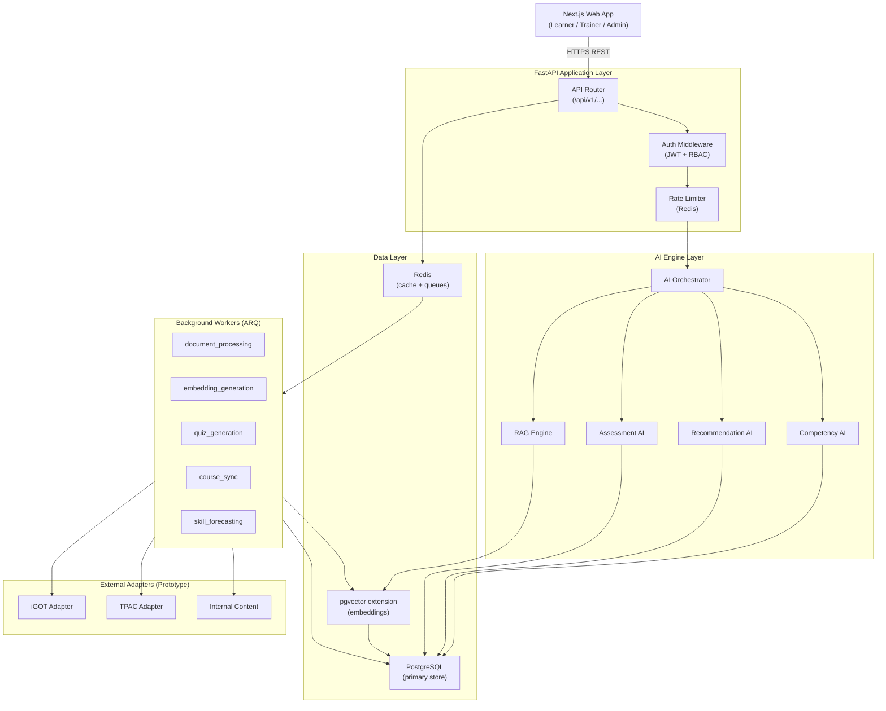

> **Integration honesty:** iGOT and TPAC adapters use a well-defined API contract with mock/seeded data during the hackathon prototype. If official API credentials become available, only the adapter implementation needs to change.

---

## 3. Frontend Architecture

**Technology:** Next.js 14+ (App Router) + TypeScript + Tailwind CSS + shadcn/ui

### Directory Structure

```
apps/web/
├── app/
│   ├── (auth)/login/ and register/
│   ├── (learner)/dashboard/ skill-dna/ learning-path/ recommendations/ assessment/ copilot/ career/
│   ├── (trainer)/documents/ quiz-studio/ question-bank/
│   └── (admin)/workforce/ heatmap/ forecast/ simulator/
├── components/
│   ├── ui/              # shadcn/ui primitives
│   ├── competency/      # Skill DNA, radar charts, gap bars
│   ├── learning/        # Path visualizer, course cards
│   ├── assessment/      # Question renderer, adaptive UI
│   ├── copilot/         # Chat interface
│   └── admin/           # Heatmaps, workforce charts
├── lib/
│   ├── api.ts           # Typed API client
│   ├── auth.ts          # Auth helpers
│   └── hooks/           # React hooks for data fetching
└── types/               # Shared TypeScript types
```

### Key Frontend Design Decisions

| Decision | Rationale |
|---|---|
| App Router (Next.js) | Server components reduce client JS; layouts enable role-based shell |
| shadcn/ui | Accessible, unstyled — fast to customize for government aesthetic |
| Recharts | Competency radars, gap bars, heatmaps without heavy charting library |
| No Redux | Server state via React Query; component state via useState |
| TypeScript strict mode | Catches API shape mismatches at compile time |

---

## 4. Backend Architecture

**Technology:** FastAPI + Python 3.11+

### Module Layout

```
services/api/
├── main.py              # FastAPI app entry point
├── config.py            # Settings via pydantic-settings
├── database.py          # SQLAlchemy async engine
├── deps.py              # Dependency injection
├── routers/             # Route handlers (auth, profile, competency, etc.)
├── models/              # SQLAlchemy ORM models
├── schemas/             # Pydantic request/response schemas
├── services/            # Business logic layer
└── ai/                  # AI engine modules
    ├── orchestrator.py
    ├── competency_engine.py
    ├── gap_engine.py
    ├── recommendation_engine.py
    ├── rag_engine.py
    ├── assessment_engine.py
    └── forecasting_engine.py
```

### Request Lifecycle

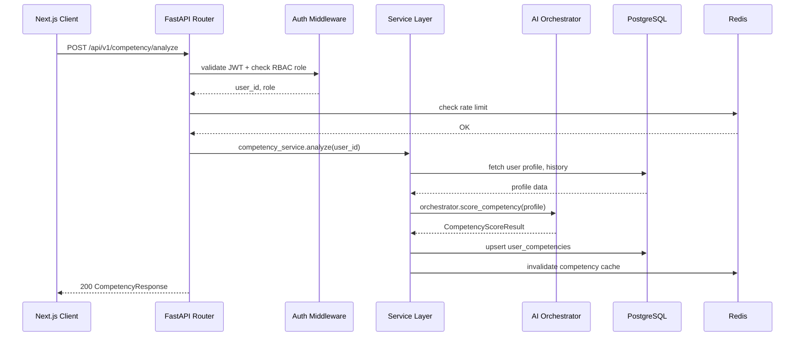

---

## 5. AI Architecture & Orchestrator

The AI Orchestrator coordinates all AI engines, manages context, applies guardrails, and handles fallbacks.

### LLM Provider Abstraction

```python
class LLMProvider(Protocol):
    async def complete(self, prompt: str, schema: type[BaseModel]) -> BaseModel: ...
    async def embed(self, text: str) -> list[float]: ...

class GeminiProvider(LLMProvider): ...
class OpenAIProvider(LLMProvider): ...
class OllamaProvider(LLMProvider): ...  # local fallback for offline demo
```

This abstraction means the prototype can switch providers without touching business logic.

---

## 6. Competency Intelligence Engine

**Purpose:** Build a dynamic, evidence-based competency profile — not just self-declared skills.

| Aspect | Detail |
|---|---|
| **Inputs** | Designation, department, role, education, work experience, training history, assessment results, quiz scores, learning activity |
| **Processing** | Weighted multi-signal aggregation (see §9) |
| **AI/ML logic** | LLM used for profile normalization — mapping free-text roles/qualifications to standard competency taxonomy |
| **Outputs** | Per-competency `{current_score, required_score, future_score, confidence, evidence_sources}` |
| **DB impact** | Upsert `user_competencies`; append to `competency_evidence` |
| **API impact** | `POST /api/v1/competency/analyze` triggers; `GET /api/v1/competency/me` reads |
| **Failure cases** | Insufficient evidence → confidence flagged LOW; LLM timeout → fallback to rule-based inference |

### Profile Normalization Flow

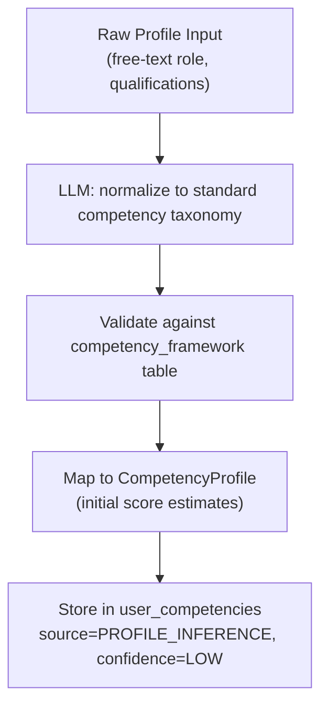

---

## 7. Skill DNA

**Purpose:** A complete visual and data representation of an official's competency fingerprint across all domains — the core differentiator from a generic LMS.

### Skill DNA JSON Structure

```json
{
  "user_id": "uuid",
  "generated_at": "2026-09-04T00:00:00Z",
  "domains": [
    {
      "domain": "Statistical Methods",
      "competencies": [
        {
          "id": "comp_survey_design",
          "name": "Survey Design",
          "current_score": 71,
          "required_score": 80,
          "future_score": 85,
          "confidence": 0.87,
          "gap": 9,
          "priority": "MEDIUM",
          "evidence_sources": ["diagnostic_assessment", "training_history"]
        }
      ]
    }
  ],
  "overall_readiness": 68,
  "top_gap": "AI / ML",
  "next_best_skill": "SQL"
}
```

### Visualization Components
- Radar chart per domain (Recharts RadarChart)
- Bar chart with current/required/future bars per competency
- Gap severity: **Critical** (red) / **High** (orange) / **Medium** (yellow) / **OK** (green)

---

## 8. Competency Framework & Graph

### Competency Taxonomy

| Domain | Example Competencies |
|---|---|
| **Statistical Methods** | Survey Design, Sampling, National Accounts, Price Statistics, Labour Statistics, Agricultural Statistics, SDG Indicators, Metadata Standards, Data Quality Frameworks |
| **Technical & Digital** | Python, R, SQL, Stata, SPSS, GIS, Data Visualization, AI/ML, Cloud Computing, APIs, Open Data |
| **Digital Governance** | Cybersecurity, Data Privacy, Digital Signatures, Government Cloud, Digital Public Infrastructure |
| **Behavioural & Managerial** | Leadership, Communication, Project Management, Ethics, Decision Making, Change Management |

### Competency Schema (SQL)

```sql
CREATE TABLE competencies (
    id UUID PRIMARY KEY,
    domain_id UUID REFERENCES competency_domains(id),
    name TEXT NOT NULL,
    description TEXT,
    beginner_threshold INT DEFAULT 25,
    intermediate_threshold INT DEFAULT 50,
    advanced_threshold INT DEFAULT 75,
    expert_threshold INT DEFAULT 90,
    is_active BOOLEAN DEFAULT TRUE
);

CREATE TABLE competency_relationships (
    source_id UUID REFERENCES competencies(id),
    target_id UUID REFERENCES competencies(id),
    relationship_type TEXT CHECK (relationship_type IN (
        'PREREQUISITE', 'RELATED', 'BUILDS_ON', 'REQUIRED_FOR'
    )),
    weight FLOAT DEFAULT 1.0,
    PRIMARY KEY (source_id, target_id, relationship_type)
);
```

### Competency Graph (Example)

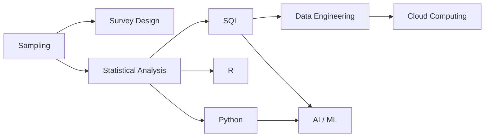

Graph traversal enables: prerequisite-aware recommendations, implicit gap propagation, and topological learning path sequencing.

---

## 9. Multi-Signal Competency Scoring

### Formula

```
CompetencyScore(c, u) =
    0.30 * DiagnosticAssessment(c, u)
  + 0.20 * PracticalEvidence(c, u)
  + 0.15 * WorkExperience(c, u)
  + 0.15 * TrainingHistory(c, u)
  + 0.10 * ProfileEvidence(c, u)
  + 0.10 * RecentLearningPerformance(c, u)
```

All weights are configurable by administrators or competency framework version.

### Confidence Score

```
Confidence(c, u) = (signals_available / total_signals) * signal_quality_factor
Range: 0.0 to 1.0
Threshold for "Needs Verification" flag: < 0.4
```

### Evidence Signals Table

| Signal | Weight | Notes |
|---|---|---|
| Diagnostic Assessment | 0.30 | Direct measurement — most objective |
| Practical Evidence | 0.20 | Task performance, submitted work |
| Work Experience | 0.15 | Role tenure × relevance coefficient |
| Training History | 0.15 | Completed courses, certifications |
| Profile Evidence | 0.10 | Self-declared + LLM-normalized |
| Recent Learning Performance | 0.10 | Quiz scores in last 90 days |

---

## 10. Skill-Gap Engine

### Gap Calculation

```
RawGap(c, u)      = RequiredScore(c, role) - CurrentScore(c, u)
FutureGap(c, u)   = FutureScore(c) - CurrentScore(c, u)

PriorityScore(c, u) =
    RawGap(c, u)
    * RoleImportanceWeight(c, role)
    * FutureDemandWeight(c)
    * CareerRelevanceWeight(c, u.target_role)
```

### Gap Priority Classification

| Priority | Condition |
|---|---|
| **CRITICAL** | RawGap >= 30 AND FutureDemandWeight > 0.7 |
| **HIGH** | RawGap >= 20 OR FutureDemandWeight > 0.5 |
| **MEDIUM** | RawGap >= 10 |
| **LOW** | RawGap > 0 |
| **OK** | RawGap <= 0 |

### Example Output

```
Competency: AI / ML
Current:        24    Required:  60    Future:  82
Raw Gap:        36    Future Gap: 58
Priority:       CRITICAL
Reason: Gap of 36 points + very high future demand (weight: 0.83)
        + prerequisite for 4 other required competencies
```

---

## 11. Career Readiness Engine

### Career Readiness Score Formula

```
CareerReadiness(u, target_role) =
    SUM [ min(CurrentScore(c,u), RequiredScore(c,target_role))
          / RequiredScore(c,target_role) ]
    / count(required_competencies)
    * 100
```

### Example

```
Target: Senior Statistical Analyst

Competency       Current  Required  Status
SQL              82       80        OK
Statistics       86       85        OK
Python           49       70        GAP (-21)
AI / ML          28       65        GAP (-37)
Data Viz         61       70        GAP (-9)
Leadership       77       75        OK

Career Readiness: 64%
```

| Aspect | Detail |
|---|---|
| **DB impact** | Writes to `career_paths` table |
| **API** | `GET /api/v1/career-readiness/me?target_role={id}` |
| **Failure** | Target role has no requirements defined → partial report with warning |

---

## 12. Recommendation Engine

### Hybrid Algorithm

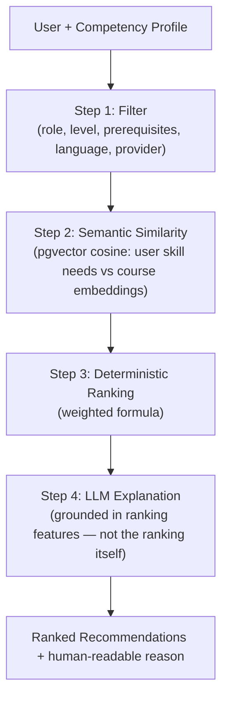

### Ranking Formula

```
RecommendationScore(course, user) =
    0.30 * NormalizedGapCoverage(course, user)
  + 0.20 * RoleRelevance(course, role)
  + 0.15 * FutureDemandWeight(course.competencies)
  + 0.15 * CareerPathRelevance(course, user.target_role)
  + 0.10 * PrerequisiteMatch(course, user.competencies)
  + 0.10 * LearningHistoryDiversity(course, user)
```

> The LLM receives ranking features as structured context. It phrases the explanation — it does **not** decide the ranking.

### Learning Path Generation

After ranking, courses are sequenced using:
1. Topological sort on competency prerequisite graph
2. Duration constraints (user-specified weekly hours)
3. Provider diversity (mix iGOT, TPAC, internal)

---

## 13. RAG Architecture & Document Ingestion

**Purpose:** Power AI Tutor and Assessment Studio with answers grounded in approved materials — not open-ended LLM generation.

### Document Ingestion Pipeline

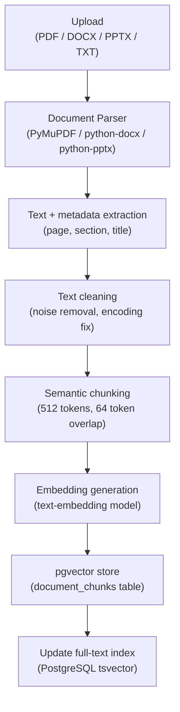

> All post-upload steps run as background worker jobs. The upload API returns immediately with a `job_id` and status polling endpoint.

### Chunk Schema (SQL)

```sql
CREATE TABLE document_chunks (
    id UUID PRIMARY KEY,
    document_id UUID REFERENCES vault_documents(id),
    chunk_index INT NOT NULL,
    content TEXT NOT NULL,
    page_number INT,
    section TEXT,
    source_type TEXT,        -- 'pdf', 'docx', 'pptx', 'transcript'
    competency_ids UUID[],   -- mapped competencies
    embedding vector(1536),  -- dimension matches embedding model
    created_at TIMESTAMPTZ DEFAULT now()
);
CREATE INDEX ON document_chunks USING ivfflat (embedding vector_cosine_ops);
```

### Semantic Retrieval (Pseudocode)

```python
async def retrieve_relevant_chunks(query, top_k=5, competency_filter=None):
    query_embedding = await embed(query)
    results = await db.execute("""
        SELECT *, 1 - (embedding <=> $1) AS similarity
        FROM document_chunks
        WHERE ($2::uuid[] IS NULL OR competency_ids && $2)
        ORDER BY embedding <=> $1
        LIMIT $3
    """, query_embedding, competency_filter, top_k)
    return results
```

---

## 14. AI Tutor / Learning Copilot

**Purpose:** Context-aware learning assistant grounded in approved content — not a generic chatbot.

### Request Flow

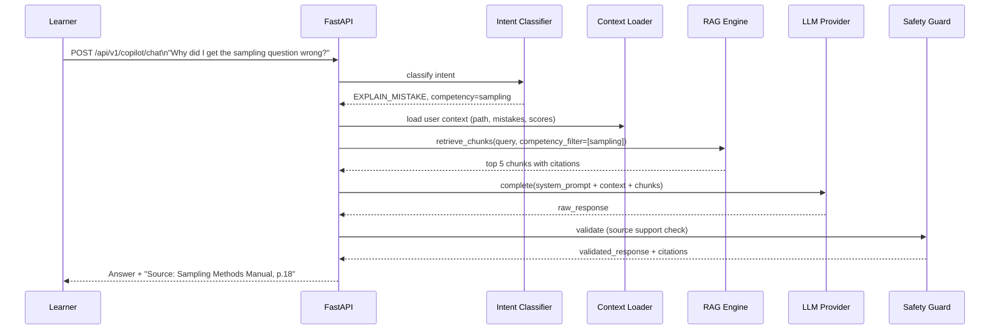

### Supported Intents

| Intent | Description |
|---|---|
| `EXPLAIN_CONCEPT` | Explain a statistical concept from approved content |
| `EXPLAIN_MISTAKE` | Diagnose why an assessment question was answered incorrectly |
| `RECOMMEND_RESOURCE` | Suggest next learning resource for a competency |
| `SUMMARIZE_DOCUMENT` | Summarize an uploaded document |
| `ANSWER_QUESTION` | General Q&A grounded in retrieved chunks |

---

## 15. Adaptive Assessment Engine

### Algorithm (MVP — Simplified)

```
State: current_difficulty in {EASY, MEDIUM, HARD}

On CORRECT answer:
    consecutive_correct += 1
    if consecutive_correct >= 2:
        difficulty = step_up(difficulty)
        consecutive_correct = 0

On WRONG answer:
    consecutive_wrong += 1
    if consecutive_wrong >= 2:
        difficulty = step_down(difficulty)
        consecutive_wrong = 0
```

**Advanced roadmap:** Replace with Item Response Theory (IRT) 3-parameter logistic model. MVP uses simplified adaptive difficulty only.

### Competency Score Update After Assessment

```
NewScore(c, u) = OldScore(c, u) * (1 - 0.3) + AssessmentScore(c, u) * 0.3
NewConfidence  = min(1.0, OldConfidence + 0.1)
```

---

## 16. AI MCQ/Quiz Generation

### Generation Prompt Strategy

```
System: You are an expert assessment designer for official statistics training.
Context: [retrieved source chunks from approved document]
Competency: {competency_name}
Difficulty: {level}

Generate {n} MCQs. Each question MUST:
1. Be directly answerable from source content above
2. Have exactly 4 options (A, B, C, D)
3. Have one unambiguously correct answer
4. Include explanation citing the source
5. NOT introduce information not in the source

Return JSON array: [{question, options, correct_option, explanation,
                    source_chunk_id, source_page, difficulty, competency_id}]
```

### MCQ Schema (SQL)

```sql
CREATE TABLE questions (
    id UUID PRIMARY KEY,
    question_text TEXT NOT NULL,
    options JSONB NOT NULL,
    correct_option CHAR(1) NOT NULL,
    explanation TEXT,
    difficulty TEXT CHECK (difficulty IN ('easy', 'medium', 'hard')),
    competency_id UUID REFERENCES competencies(id),
    source_document_id UUID REFERENCES vault_documents(id),
    source_chunk_id UUID REFERENCES document_chunks(id),
    source_page INT,
    generation_status TEXT DEFAULT 'PENDING_REVIEW',
    quality_score FLOAT,
    created_at TIMESTAMPTZ DEFAULT now()
);
```

---

## 17. Assessment Quality Guard

**Purpose:** Never publish raw LLM output. Every generated question passes through a multi-stage quality pipeline.

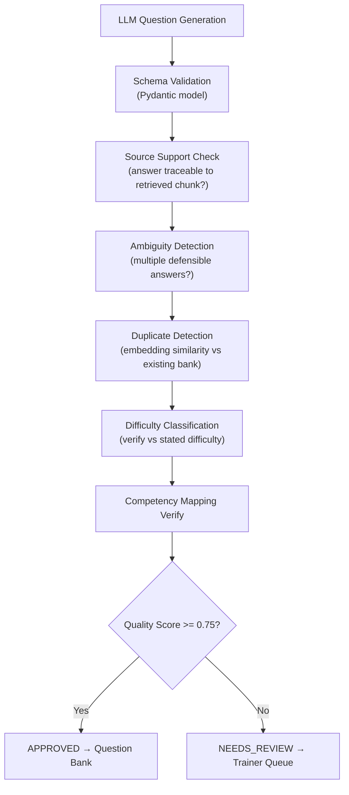

### Quality Score Formula

```
QualityScore =
    source_support_score   * 0.40
  + answer_unambiguity     * 0.30
  + difficulty_match       * 0.20
  + competency_match       * 0.10

Auto-approval threshold: 0.75
Below threshold: Status = NEEDS_REVIEW
```

---

## 18. iGOT Integration Architecture

> **PROTOTYPE NOTICE:** Live iGOT Karmayogi API access requires official registration. This architecture defines the adapter contract. The hackathon uses a mock adapter with seeded course data matching the same API shape. If credentials are obtained, only the adapter implementation changes — zero core system changes.

### Adapter Interface

```python
class CourseProvider(Protocol):
    async def search_courses(self, competencies, level, language, limit) -> list[NormalizedCourse]: ...
    async def get_course_detail(self, course_id) -> NormalizedCourse: ...
    async def get_user_enrollment_status(self, user_id, course_id) -> EnrollmentStatus: ...

class IGOTAdapter(CourseProvider):
    is_mock: bool = True  # Set False only when live API credentials available
```

### Normalized Course Model

```python
class NormalizedCourse(BaseModel):
    course_id: str
    title: str
    description: str
    provider: Literal["iGOT", "TPAC", "INTERNAL"]
    duration_hours: float
    language: str
    difficulty: Literal["beginner", "intermediate", "advanced"]
    competency_ids: list[UUID]
    prerequisite_competency_ids: list[UUID]
    course_url: str
    is_mock: bool = True  # Flag displayed in UI
```

---

## 19. TPAC Integration Architecture

> **PROTOTYPE NOTICE:** NSSTA/TPAC integration uses the same adapter pattern as iGOT. Mock data reflects typical official statistics training programmes (methodology workshops, software training). Live integration requires NSSTA cooperation.

TPAC-specific normalization:
- Enrollment model: `NOMINATION_REQUIRED` (not self-enrollment)
- Format: in-person / blended (not purely online)
- Focus: official statistics methodology

---

## 20. Future Skill Prediction

### MVP Approach (Rule-Based + Configurable)

```python
# Each rule: (competency, base_demand_weight, annual_growth_rate)
skill_demand_rules = [
    ("AI / ML",         0.60, 0.15),
    ("Cloud Computing", 0.45, 0.12),
    ("Python",          0.70, 0.08),
    ("SDG Indicators",  0.55, 0.06),
    ("Data Privacy",    0.40, 0.10),
]

def forecast_demand(competency_id, years_ahead=3) -> float:
    base, growth = get_rule(competency_id)
    return min(1.0, base * (1 + growth) ** years_ahead)
```

> **Prototype label:** Demand curves are configured estimates — NOT official government forecasts. Clearly marked as **"Projected Demand (Prototype)"** in UI.

**Advanced roadmap:** ML-trained model on actual MoSPI/DARPG workforce planning data when available.

---

## 21. Workforce Simulator

**Purpose:** Allow administrators to run "what if" scenarios on workforce capability requirements.

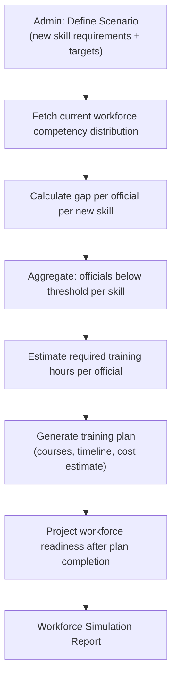

Simulation results always include `is_prototype_data: true` flag during hackathon.

---

## 22. Analytics Pipeline

### Admin Workforce Analytics

| Metric | Source | Refresh |
|---|---|---|
| Average workforce readiness | Aggregate `user_competencies` | Daily |
| Department competency heatmap | Group by dept × competency | Daily |
| Critical skill gaps | Competencies with avg gap > 20 | Daily |
| Training effectiveness | Pre/post assessment score delta | Per batch |
| Course completion | `learning_path_items.status` | Real-time |

All analytics cached in Redis with TTL. Background workers recompute on schedule.

---

## 23. Database Architecture

### Entity Relationship Overview

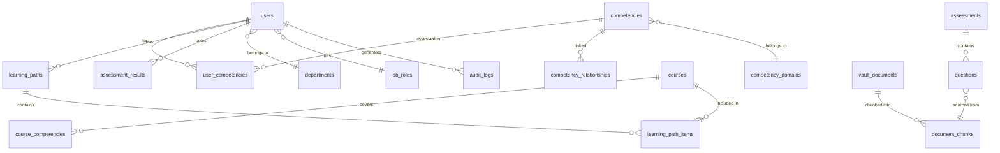

### Core Table Definitions

```sql
-- Core user competency state
CREATE TABLE user_competencies (
    id UUID PRIMARY KEY DEFAULT gen_random_uuid(),
    user_id UUID REFERENCES users(id) ON DELETE CASCADE,
    competency_id UUID REFERENCES competencies(id),
    current_score FLOAT CHECK (current_score BETWEEN 0 AND 100),
    required_score FLOAT,
    future_score FLOAT,
    confidence FLOAT CHECK (confidence BETWEEN 0 AND 1),
    evidence_sources TEXT[],
    last_assessed_at TIMESTAMPTZ,
    updated_at TIMESTAMPTZ DEFAULT now(),
    UNIQUE (user_id, competency_id)
);

-- Audit trail (insert-only, no UPDATE/DELETE permissions)
CREATE TABLE audit_logs (
    id BIGSERIAL PRIMARY KEY,
    actor_user_id UUID REFERENCES users(id),
    action TEXT NOT NULL,
    resource_type TEXT,
    resource_id UUID,
    result TEXT,
    ip_address INET,
    metadata JSONB,
    created_at TIMESTAMPTZ DEFAULT now()
);
```

### Performance Indexes

```sql
CREATE INDEX idx_user_competencies_user ON user_competencies(user_id);
CREATE INDEX idx_document_chunks_embedding ON document_chunks
    USING ivfflat(embedding vector_cosine_ops);
CREATE INDEX idx_audit_logs_actor ON audit_logs(actor_user_id, created_at DESC);
CREATE INDEX idx_questions_status ON questions(generation_status, competency_id);
```

---

## 24. Redis & Background Jobs

### Redis Use Cases

| Use | Pattern | TTL |
|---|---|---|
| API rate limiting | Fixed window per user_id | 1 minute |
| Competency score cache | `competency:{user_id}` | 15 min |
| Recommendation cache | `recs:{user_id}` | 30 min |
| Admin analytics cache | `analytics:{dept_id}` | 1 hour |
| Background job queue | ARQ job queues | — |
| Job status tracking | `job:{job_id}` | 24 hours |

> Redis is cache and queue only. PostgreSQL remains the single source of truth.

### Background Worker Jobs (ARQ)

```python
async def process_document(ctx, document_id: str): ...      # parse, chunk, embed
async def generate_embeddings(ctx, chunk_ids: list[str]): ...
async def generate_quiz(ctx, document_id, competency_id, n): ...
async def sync_courses(ctx, provider: str): ...              # iGOT/TPAC adapter sync
async def compute_analytics(ctx, department_id: str): ...
async def forecast_skills(ctx): ...
```

---

## 25. API Architecture

### Complete Route Map

```
Authentication
  POST   /api/v1/auth/register
  POST   /api/v1/auth/login
  POST   /api/v1/auth/refresh
  POST   /api/v1/auth/logout

Competency
  POST   /api/v1/competency/analyze
  GET    /api/v1/competency/me
  GET    /api/v1/competency/me/gaps
  GET    /api/v1/competency/me/next-skill
  GET    /api/v1/competency/framework

Recommendations
  POST   /api/v1/recommendations/generate
  GET    /api/v1/recommendations/me

Learning Path
  POST   /api/v1/learning-path/generate
  GET    /api/v1/learning-path/me
  PATCH  /api/v1/learning-path/{id}/items/{item_id}

Documents (Trainer)
  POST   /api/v1/documents/upload
  GET    /api/v1/documents/
  DELETE /api/v1/documents/{id}
  POST   /api/v1/documents/{id}/generate-quiz
  GET    /api/v1/documents/{id}/job-status

Assessment
  POST   /api/v1/assessment/generate
  GET    /api/v1/assessment/{id}
  POST   /api/v1/assessment/{id}/submit
  GET    /api/v1/assessment/{id}/results

Question Bank (Trainer)
  GET    /api/v1/questions/pending-review
  PATCH  /api/v1/questions/{id}/approve
  PATCH  /api/v1/questions/{id}/reject

AI Copilot
  POST   /api/v1/copilot/chat
  GET    /api/v1/copilot/history

Career
  GET    /api/v1/career/readiness
  GET    /api/v1/career/roles

Admin
  GET    /api/v1/admin/workforce
  GET    /api/v1/admin/competency-heatmap
  GET    /api/v1/admin/future-skills
  POST   /api/v1/admin/workforce/simulate
  GET    /api/v1/admin/training-effectiveness
```

### Standard Response Envelope

```python
class APIResponse(BaseModel, Generic[T]):
    success: bool
    data: T | None
    error: str | None
    request_id: str
    is_prototype_data: bool = False  # True for seeded/mock data
```

---

## 26. Authentication & RBAC

### RBAC Matrix

| Role | Own Data | Team Analytics | Org Analytics | Trainer Tools | Admin Tools |
|---|---|---|---|---|---|
| `EMPLOYEE` | Yes | No | No | No | No |
| `TRAINER` | Yes | Own cohort | No | Yes | No |
| `MANAGER` | Yes | Own team | No | No | No |
| `ADMIN` | Yes | Yes | Yes | Yes | Yes |
| `SUPER_ADMIN` | Yes | Yes | Yes | Yes | Yes + system config |

### OAuth2/OIDC Readiness

Auth module is designed for drop-in replacement with an OIDC provider (NIC SSO, UMANG). External identity stored in `users.external_id`. Swapping to SSO requires only changing the auth router.

---

## 27. Security & Privacy

| Control | Implementation |
|---|---|
| Transport security | TLS 1.2+ enforced at reverse proxy |
| Password storage | bcrypt (cost factor >= 12) |
| JWT signing | RS256 (asymmetric) |
| API rate limiting | Redis sliding window per user |
| Input validation | Pydantic strict mode on all request schemas |
| SQL injection | SQLAlchemy parameterized queries only |
| File upload | MIME type validation, size limit, virus scan hook |
| Data minimization | No PII in audit log metadata |
| Least privilege | Each role only queries permitted views |
| Audit trail | Insert-only audit_logs table |

---

## 28. Audit Logging

### Events Logged

| Event | When |
|---|---|
| `LOGIN` / `LOGIN_FAILED` | Authentication attempt |
| `PROFILE_UPDATE` | Any profile field change |
| `COMPETENCY_ANALYZED` | Score recalculation |
| `ASSESSMENT_SUBMITTED` | Learner submits |
| `DOCUMENT_UPLOADED` | Trainer uploads |
| `QUIZ_GENERATED` | AI generation triggered |
| `QUESTION_APPROVED` / `REJECTED` | Trainer review action |
| `COURSE_RECOMMENDED` | Recommendation batch |
| `ROLE_CHANGED` | User role modified |
| `DATA_EXPORTED` | Admin data export |

Audit log rows are **insert-only** — no UPDATE or DELETE permissions granted.

---

## 29. Scalability

### Horizontal Scaling Design

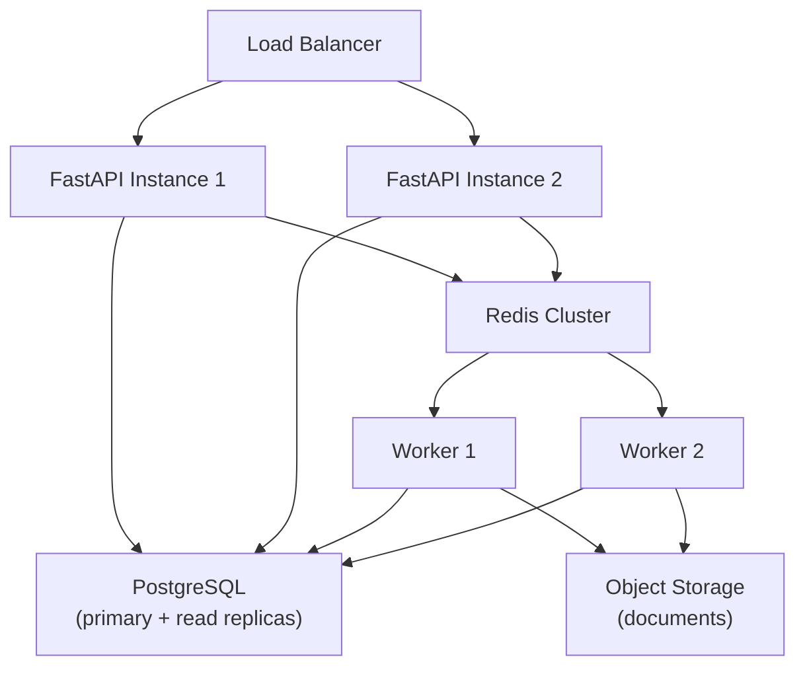

| Pattern | Applied Where |
|---|---|
| Connection pooling (asyncpg) | All DB operations |
| Read replica routing | Analytics queries |
| Redis caching | Competency profiles, recommendations |
| Pagination (cursor-based) | All list endpoints |
| Async I/O | All FastAPI handlers |
| Background offloading | Document processing, LLM calls |

---

## 30. Observability

### Application Metrics
- API latency (p50/p95/p99) per endpoint
- Error rate per endpoint
- Redis queue depth per job type
- Worker job success/failure rate
- DB connection pool saturation

### AI Metrics

| Metric | Tracked |
|---|---|
| RAG retrieval latency | Per copilot request |
| LLM response latency | Per AI call |
| Quiz generation success rate | Worker job outcomes |
| Quality guard rejection rate | `questions.generation_status` distribution |
| Source support rate | Quality score analysis |

### Structured Logging

```python
log.info("competency.scored",
    user_id=user_id, competency_id=competency_id,
    score=score, confidence=confidence, signals_used=signals)
```

---

## 31. Deployment Architecture

### Hackathon (Docker Compose)

```yaml
services:
  frontend:  # Next.js — port 3000
  api:       # FastAPI — port 8000
  worker:    # ARQ background workers
  postgres:  # pgvector/pgvector:pg16
  redis:     # redis:7-alpine
```

### Cloud-Ready Production Path

| Component | Managed Service |
|---|---|
| Frontend | Vercel / Cloud Run |
| API | Cloud Run / GKE |
| Workers | Cloud Run Jobs |
| PostgreSQL | Cloud SQL (pgvector enabled) |
| Redis | Memorystore / ElastiCache |
| Object Storage | Cloud Storage / S3 |

---

## 32. Failure Handling

| Failure | Mitigation |
|---|---|
| LLM provider timeout | Retry 3x with backoff; fallback to cached recommendation |
| Embedding model failure | Queue job for retry; document marked `PROCESSING_FAILED` |
| PostgreSQL connection loss | SQLAlchemy retry + circuit breaker; 503 with retry-after |
| Redis unavailable | Graceful degradation: disable rate limiting, bypass cache |
| Background job crash | ARQ retries; dead letter queue for inspection |
| Document parse failure | Mark `PARSE_FAILED`; notify trainer with format guidance |
| All questions rejected by Quality Guard | Return partial; flag for review; never silent failure |

---

## 33. AI Hallucination Mitigation

### Layered Approach

1. **RAG:** Ground all answers in approved source documents
2. **Structured output schemas:** LLM returns validated JSON, not prose
3. **Pydantic validation:** Schema violations rejected before persistence
4. **Source support check:** Answer must trace to retrieved chunk
5. **Confidence thresholds:** Low confidence → human review queue
6. **Human-in-the-loop:** Trainers approve generated questions
7. **Citation display:** Users always see source document + page number

### What the LLM is NOT Permitted to Do

- Generate competency scores (deterministic formula does this)
- Decide recommendation rankings (formula does this)
- Generate questions without source chunks (RAG required)
- Produce content without structured output schema enforcement

---

## 34. MVP vs Advanced Features

### MVP — Must Work End-to-End for Demo

| Feature | Notes |
|---|---|
| Auth + RBAC (5 roles) | Full implementation |
| Profile creation + normalization | LLM-assisted normalization |
| Competency framework (seeded) | 30-50 competencies seeded |
| Multi-signal scoring (3+ signals) | Full formula with configurable weights |
| Skill DNA visualization | Radar + bar charts |
| Skill-gap engine + priority | All 5 priority levels |
| Next Best Skill | Derived from gap engine |
| Hybrid recommendation engine | Filter + semantic + ranking + explanation |
| Personalized learning path | Graph-sequenced |
| Document upload + RAG ingestion | Full pipeline (background job) |
| MCQ generation + quality guard | 7-stage pipeline |
| Adaptive assessment (simplified) | Step-up/down algorithm |
| AI Learning Copilot | 5 intents, RAG-grounded |
| Career readiness engine | Score + gap analysis |
| Admin workforce heatmap | Aggregated, seeded data |
| iGOT adapter (mock data) | ⚠️ Prototype — same API contract |
| TPAC adapter (mock data) | ⚠️ Prototype — same API contract |

### Advanced / Roadmap

| Feature | Status |
|---|---|
| Live iGOT API integration | Requires official credentials |
| Live TPAC API integration | Requires NSSTA cooperation |
| IRT-based adaptive testing | Post-hackathon |
| ML-trained skill demand forecasting | Requires workforce dataset |
| Hindi/Bengali multilingual support | Phase 2 |
| Video transcript ingestion | Phase 2 |
| SSO/OIDC integration (NIC) | Requires government credentials |

---

*See also: [02-TECH-STACK-AND-WHY.md](./02-TECH-STACK-AND-WHY.md) · [03-RESOURCES.md](./03-RESOURCES.md) · [04-END-TO-END-WORKFLOW.md](./04-END-TO-END-WORKFLOW.md)*
