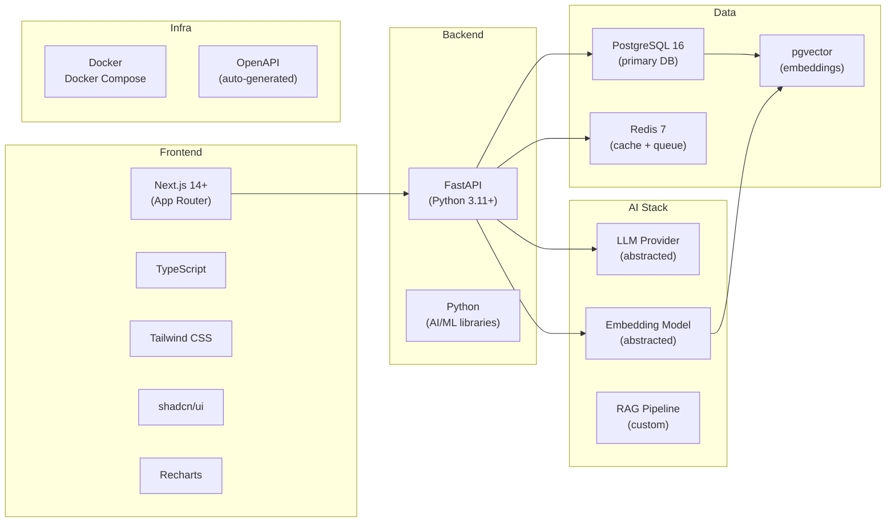

# SANKHYA AI — Technology Stack & Decision Record

> **Document status:** SIH 2026 | Problem Statement 26101
> **Principle:** Use the smallest stack that can realistically deliver the full MVP. No technology should be added to appear complex.

---

## Table of Contents

1. [Stack Overview](#1-stack-overview)
2. [Frontend: Next.js](#2-frontend-nextjs)
3. [Language: TypeScript](#3-language-typescript)
4. [UI: Tailwind CSS + shadcn/ui](#4-ui-tailwind-css--shadcnui)
5. [Charts: Recharts](#5-charts-recharts)
6. [Backend: FastAPI + Python](#6-backend-fastapi--python)
7. [Database: PostgreSQL](#7-database-postgresql)
8. [Vector Search: pgvector](#8-vector-search-pgvector)
9. [Cache & Queue: Redis](#9-cache--queue-redis)
10. [Background Workers: ARQ](#10-background-workers-arq)
11. [Containers: Docker + Docker Compose](#11-containers-docker--docker-compose)
12. [Cloud Deployment](#12-cloud-deployment)
13. [LLM Provider: Abstracted Layer](#13-llm-provider-abstracted-layer)
14. [Embedding Model](#14-embedding-model)
15. [RAG Stack](#15-rag-stack)
16. [Authentication](#16-authentication)
17. [API Documentation: OpenAPI](#17-api-documentation-openapi)
18. [Testing](#18-testing)
19. [Monitoring & Logging](#19-monitoring--logging)
20. [Stack Summary Table](#20-stack-summary-table)

---

## 1. Stack Overview



**Total distinct technology categories: 9.** This is a deliberate choice — each technology addresses a clear, irreplaceable need.

---

## 2. Frontend: Next.js

### What we use
Next.js 14+ with the App Router.

### Why we use it
| Criterion | Detail |
|---|---|
| **SSR + Server Components** | Data-heavy pages (competency profile, admin heatmap) render on the server — faster first paint, better for low-bandwidth users in government settings |
| **Route-based code splitting** | Learner, Trainer, and Admin routes are automatically split — each role loads only their code |
| **Layout system** | Role-based layouts (learner shell vs admin shell) are clean with App Router nested layouts |
| **TypeScript native** | First-class TS support reduces bugs in typed API response handling |
| **API routes** | Can proxy sensitive calls without exposing backend directly to browser |

### Problem it solves
A platform with three distinct user roles (learner, trainer, admin), data-heavy visualizations, and real-time assessment UI needs a framework that handles routing, SSR, and code splitting without manual configuration.

### Alternatives considered

| Alternative | Reason rejected |
|---|---|
| **Vite + React SPA** | No SSR — slower initial loads; all routing manual; no API route proxying |
| **Remix** | Excellent SSR but smaller ecosystem; harder for team members unfamiliar with it |
| **Angular** | More verbose, longer setup time for hackathon; heavier bundle |
| **Vue/Nuxt** | Good choice but team expertise is Next.js; switching cost not justified |

### Hackathon practicality
Next.js is the fastest path from zero to a polished multi-page app with routing, authentication layouts, and visualizations. The ecosystem (shadcn, Recharts, React Query) is well-documented.

### Production scalability
Deploy to Vercel (native Next.js hosting) or Cloud Run. Static assets are CDN-served. Server components scale horizontally with the hosting platform.

---

## 3. Language: TypeScript

### What we use
TypeScript 5+ with strict mode enabled on both frontend and as shared type definitions consumed by the backend Pydantic schemas.

### Why we use it
The API contract between FastAPI (Pydantic) and the Next.js client is the most error-prone boundary in the system. TypeScript + Pydantic enforce shape consistency at compile time and runtime respectively.

### Problem it solves
- Prevents runtime errors from mismatched API response shapes (e.g., score returned as string instead of float)
- Enables autocomplete for complex data types (CompetencyProfile, AssessmentResult, SkillDNA)
- Documents intent — a function signature is documentation

### Alternatives considered

| Alternative | Reason rejected |
|---|---|
| **Plain JavaScript** | No compile-time safety; assessment schema mismatches become runtime bugs |
| **Flow** | Dead ecosystem; no benefit over TypeScript |

---

## 4. UI: Tailwind CSS + shadcn/ui

### What we use
Tailwind CSS for utility-first styling. shadcn/ui for accessible, composable component primitives.

### Why Tailwind CSS

| Benefit | Impact |
|---|---|
| No context switching | Styles live in JSX, not separate CSS files — faster iteration |
| Design system via config | Colors, spacing, typography all in one `tailwind.config` |
| No unused CSS in production | PurgeCSS integration by default |
| Government aesthetic | Easy to configure to a professional, accessible palette |

### Why shadcn/ui over alternatives

| Criterion | shadcn/ui | Material UI | Chakra UI |
|---|---|---|---|
| Bundle impact | Zero (components are copied into project) | Large (~200kb) | Medium |
| Customization | Full ownership of component code | Override system | Override system |
| Accessibility | Radix UI primitives — ARIA correct | Good | Good |
| Hackathon speed | Pre-built forms, modals, tables | Faster first setup | Faster first setup |
| Government look | Easily stripped to minimal | Hard to de-Google | Possible |

### Alternatives considered

| Alternative | Reason rejected |
|---|---|
| **Material UI** | Google aesthetic hard to override; large bundle; over-styled for government platform |
| **Ant Design** | Chinese enterprise aesthetic; harder to customize; slower |
| **Chakra UI** | Good option but less composable than Radix/shadcn at low level |
| **No component library (raw Tailwind)** | Too slow for hackathon — forms, modals, tooltips take time to build accessibly |

---

## 5. Charts: Recharts

### What we use
Recharts for all data visualizations: competency radar, gap bars, heatmap, career readiness gauge, workforce trend lines.

### Why Recharts
- SVG-based — renders clearly at all resolutions
- React-native (no imperative DOM manipulation)
- RadarChart is a first-class component — perfect for Skill DNA visualization
- Sufficient for all SANKHYA AI chart types without a heavier library

### Alternatives considered

| Alternative | Reason rejected |
|---|---|
| **D3.js** | Too low-level; heatmaps require significant custom work; not React-native |
| **Chart.js** | Canvas-based (less crisp); requires react-chartjs-2 wrapper |
| **Victory** | Similar to Recharts but smaller community and fewer chart types |
| **ECharts** | Excellent for complex charts but heavier bundle; overkill for MVP |

---

## 6. Backend: FastAPI + Python

### What we use
FastAPI as the web framework. Python 3.11+ as the language.

### Why FastAPI

| Feature | Benefit |
|---|---|
| Async-native | Handles concurrent AI calls without blocking |
| Pydantic-first | Request/response validation is automatic and typed |
| Auto OpenAPI | `/docs` and `/redoc` generated from code — no separate API documentation effort |
| Dependency injection | Clean pattern for database sessions, current user, permissions |
| Speed | Among the fastest Python frameworks (comparable to Node.js express) |

### Why Python

| Benefit | Irreplaceable for SANKHYA AI |
|---|---|
| AI/ML ecosystem | PyTorch, scikit-learn, sentence-transformers, LangChain — all Python-native |
| LLM SDKs | Google Generative AI, OpenAI, Anthropic SDKs are Python-first |
| Document parsing | PyMuPDF, python-docx, python-pptx — best libraries in Python |
| Data processing | pandas, numpy for analytics pipeline |
| One language for API + AI | No polyglot boundary between web layer and ML layer |

### Alternatives considered

| Alternative | Reason rejected |
|---|---|
| **Node.js + Express/Fastify** | Excellent for REST APIs but AI/ML ecosystem is Python-native; bridging adds complexity |
| **Go** | Fast but minimal AI/ML library support; incompatible with Python-native LLM SDKs |
| **Django** | More batteries-included but sync-first; slower for AI-heavy concurrent workloads |
| **Flask** | No async, no Pydantic, no auto OpenAPI — inferior to FastAPI for this use case |

### Hackathon practicality
FastAPI's auto-generated docs (`/docs`) serve as live API documentation during the demo. Pydantic schemas double as documentation for judges reviewing the code.

---

## 7. Database: PostgreSQL

### What we use
PostgreSQL 16 as the single relational database.

### Why PostgreSQL

| Feature | Benefit for SANKHYA AI |
|---|---|
| ACID transactions | Assessment submission + competency score update must be atomic |
| JSONB | Flexible storage for competency evidence, question options, audit metadata |
| Full-text search (tsvector) | Fallback text search on courses and competencies |
| pgvector extension | Embedding storage and similarity search in the same database (see §8) |
| Array types | `competency_ids UUID[]` on document chunks enables efficient filtering |
| Row-level security | PostgreSQL RLS can enforce RBAC at database level if needed |
| Mature ecosystem | SQLAlchemy async, Alembic migrations, asyncpg driver — well-supported |

### Why NOT a separate vector database

Keeping pgvector in the same database as relational data:
- Eliminates a separate service (reduces ops complexity in hackathon)
- Enables JOIN between vector search results and user/competency data in one query
- Sufficient performance for hackathon scale (thousands of documents, not billions)

### Alternatives considered

| Alternative | Reason rejected |
|---|---|
| **MySQL** | Weaker JSON support; no native vector extension; less expressive |
| **MongoDB** | Document store good for flexibility but poor for relational joins (user ↔ competency ↔ course) |
| **SQLite** | Not suitable for concurrent multi-user production-like setup |
| **CockroachDB** | Distributed but adds complexity without benefit at this scale |

---

## 8. Vector Search: pgvector

### What we use
pgvector PostgreSQL extension. Tables use `vector(1536)` columns indexed with IVFFlat for approximate nearest neighbor search.

### Why pgvector

| Feature | Benefit |
|---|---|
| Same database | No extra service; embeddings JOIN with relational data in single query |
| IVFFlat index | Fast approximate similarity search at hackathon scale |
| cosine similarity operator (`<=>`) | Directly used in SQL ORDER BY for retrieval |
| HNSW index (pg16+) | Available for production scale if needed post-hackathon |

### Example Query Pattern

```sql
SELECT dc.content, dc.source_page, dc.competency_ids,
       1 - (dc.embedding <=> $1) AS similarity
FROM document_chunks dc
WHERE dc.competency_ids && $2::uuid[]
ORDER BY dc.embedding <=> $1
LIMIT 5;
```

This query retrieves relevant chunks, filters by competency, and ranks by semantic similarity — all in one database round trip.

### Alternatives considered

| Alternative | Reason rejected |
|---|---|
| **Pinecone** | Managed, fast — but adds external service, API cost, network latency, and removes JOIN capability |
| **Weaviate** | Separate service; overkill for hackathon; adds ops burden |
| **Chroma** | Good for local prototyping but not production-ready; no JOIN with relational data |
| **Qdrant** | Excellent vector DB but separate service cost at hackathon is not justified |

**Decision: pgvector wins because it keeps the stack to one database for both relational and vector workloads.**

---

## 9. Cache & Queue: Redis

### What we use
Redis 7 (Alpine) for two distinct purposes: caching and job queuing.

### Why Redis for Caching

| Cache target | TTL | Benefit |
|---|---|---|
| Competency profile | 15 min | Avoids re-running 6-signal scoring on every page load |
| Recommendation list | 30 min | Expensive ranking computation; only refresh on trigger |
| Admin analytics | 1 hour | Aggregate queries across all users are slow |
| Rate limit counters | 1 min windows | Sub-millisecond lookup vs database query |

### Why Redis for Job Queue (vs direct DB queue)

- Fast enqueue/dequeue (sub-millisecond) vs PostgreSQL LISTEN/NOTIFY or polling
- ARQ uses Redis natively — no additional abstraction needed
- Job state, progress, and retry counts stored in Redis

### Alternatives considered

| Alternative | Reason rejected |
|---|---|
| **Memcached** | No persistence; no pub/sub; no list structures needed for queues |
| **RabbitMQ** | Excellent message broker but heavier setup; Redis sufficient for this workload |
| **Celery + Redis** | Celery adds complexity; ARQ is async-native and lighter |
| **PostgreSQL LISTEN/NOTIFY** | Polling inefficiency; less reliable for high-frequency job scheduling |

---

## 10. Background Workers: ARQ

### What we use
ARQ (Async Redis Queue) — a Python async job queue backed by Redis.

### Why ARQ over Celery

| Criterion | ARQ | Celery |
|---|---|---|
| Async-native | Yes (asyncio) | No (uses sync workers or gevent) |
| FastAPI compatibility | Seamless (same async event loop) | Requires sync adapter or separate process pool |
| Setup complexity | Minimal | Requires broker config, result backend config |
| Job types | All background AI jobs | Same |
| Hackathon speed | Faster to set up | More configuration |

### Jobs offloaded to Workers

| Job | Reason to offload |
|---|---|
| Document parsing + chunking | CPU-intensive; blocks API for 10-30 seconds |
| Embedding generation | LLM API call; variable latency |
| Quiz generation | Multiple LLM calls + quality pipeline; 30-120 seconds |
| Course sync | External adapter calls; network dependent |
| Analytics computation | Full table scans across all users |
| Skill forecasting | Computation across all competencies |

---

## 11. Containers: Docker + Docker Compose

### What we use
Docker for all services. Docker Compose for local development and hackathon demo.

### Why Docker

| Benefit | Impact |
|---|---|
| Reproducible environment | "Works on my machine" is eliminated — judges run the same environment |
| One-command startup | `docker compose up` starts all 5 services (frontend, api, worker, postgres, redis) |
| Port isolation | No conflicts with local system Python, PostgreSQL, Redis versions |
| Production parity | Same images used in cloud deployment |
| pgvector availability | `pgvector/pgvector:pg16` official image handles extension installation |

### docker-compose.yml Overview

```yaml
services:
  frontend:    # Next.js — 3000:3000
  api:         # FastAPI — 8000:8000, env vars, depends_on postgres+redis
  worker:      # Same image as api, command: arq workers.WorkerSettings
  postgres:    # pgvector/pgvector:pg16, persistent volume
  redis:       # redis:7-alpine
```

### Alternatives considered

| Alternative | Reason rejected |
|---|---|
| **No containers (direct install)** | Environment inconsistency; Python version conflicts; setup time for judges |
| **Kubernetes** | Overkill for hackathon; Docker Compose is sufficient and simpler to demo |
| **Podman** | Compatible but Docker is more familiar and better supported by team |

---

## 12. Cloud Deployment

### Recommended Path (Post-Hackathon)

| Component | Service | Rationale |
|---|---|---|
| Frontend | Vercel | Native Next.js hosting; zero-config CDN; preview deployments |
| API | Google Cloud Run | Serverless containers; scales to zero; pay per request |
| Workers | Cloud Run Jobs | Scheduled and on-demand batch jobs |
| PostgreSQL | Cloud SQL (PostgreSQL 16) | Managed, pgvector-supported, automated backups |
| Redis | Memorystore for Redis | Managed, low-latency, no ops overhead |
| Object Storage | Cloud Storage | Document vault; signed URLs for secure access |
| Load Balancer | Cloud Load Balancing | HTTPS termination, health checks |

### Why Google Cloud
- MoSPI and government systems in India increasingly use GCP
- Cloud SQL supports pgvector — keeps the same database stack
- Cloud Run containers match Docker Compose images directly

### Alternative Cloud Options

| Cloud | Assessment |
|---|---|
| **AWS** | Excellent (RDS for PostgreSQL + pgvector, ElastiCache, ECS). Fully viable. |
| **Azure** | Viable. Flexible Server PostgreSQL supports pgvector. |
| **NIC Cloud** | Government preference — migration path if NIC provides PostgreSQL + Redis managed services |

---

## 13. LLM Provider: Abstracted Layer

### What we use
An abstract `LLMProvider` interface with concrete implementations. Provider is configured via environment variable.

### Why Provider Abstraction

The biggest risk in an AI platform is **vendor lock-in**. By defining a protocol:

```python
class LLMProvider(Protocol):
    async def complete(self, messages: list[Message], schema: type[T]) -> T: ...
    async def embed(self, text: str) -> list[float]: ...
```

We can switch providers without touching any business logic.

### Provider Options Evaluated

| Provider | Strengths | Weaknesses | SANKHYA AI Usage |
|---|---|---|---|
| **Google Gemini 1.5 Pro/Flash** | Context length, multilingual, India-relevant | API cost, rate limits | Primary (hackathon) |
| **OpenAI GPT-4o** | Strong reasoning, structured output | Cost, US data residency concern | Secondary |
| **Ollama (local)** | Free, offline, no data leaves machine | Weaker quality, slower | Demo fallback / offline |
| **Anthropic Claude** | Strong reasoning, good JSON output | API access, cost | Future option |

### Hackathon Strategy
Use Gemini Flash for high-volume tasks (quiz generation, copilot responses). Use Gemini Pro for complex reasoning (profile normalization, explanation generation). Keep API usage within free tier limits where possible.

---

## 14. Embedding Model

### What we use
A sentence embedding model accessed via the same `LLMProvider` abstraction.

### Options Evaluated

| Model | Dimensions | Cost | Quality | Decision |
|---|---|---|---|---|
| `text-embedding-004` (Google) | 768 | Low | High multilingual | **Primary** |
| `text-embedding-3-small` (OpenAI) | 1536 | Very low | High English | Fallback |
| `all-MiniLM-L6-v2` (local HuggingFace) | 384 | Free | Good English | Offline fallback |
| `multilingual-e5-large` (HuggingFace) | 1024 | Free | Good multilingual | Future Hindi support |

### Why Dedicated Embedding Model (not LLM embeddings)

Embedding models are optimized specifically for semantic similarity tasks. Using LLM completion API for embeddings is slower and more expensive. Dedicated embedding models (MiniLM, E5) run locally and provide comparable quality at near-zero cost.

---

## 15. RAG Stack

### What we use
Custom RAG implementation using: python-docx / PyMuPDF / python-pptx (parsing) + embedding model + pgvector (retrieval) + LLM (generation).

### Why Not LangChain or LlamaIndex

| Tool | Assessment |
|---|---|
| **LangChain** | High abstraction hides the retrieval and prompting details that judges will ask about. Debugging chain failures is hard. Overkill for our defined use cases. |
| **LlamaIndex** | Better for complex indexing strategies but adds dependency weight. Our chunking + pgvector is explicit and auditable. |
| **Custom RAG** | Full control over chunking strategy, retrieval filtering, citation tracking, and quality guardrails. Easier to explain and demonstrate to judges. |

### Chunking Strategy

```
Chunk size: 512 tokens
Overlap: 64 tokens (prevents context loss at boundaries)
Strategy: Sentence-aware (don't split mid-sentence)
Metadata stored: page_number, section, document_id, competency_ids
```

Smaller chunks (256) improve precision. Larger chunks (1024) improve context. 512 is the standard starting point for official document RAG.

---

## 16. Authentication

### What we use
JWT-based authentication with bcrypt password hashing. RBAC enforced at the FastAPI dependency injection layer.

### JWT Configuration
- Access token: RS256, 15-minute expiry
- Refresh token: stored securely (httpOnly cookie or secure storage), 7-day expiry
- Token rotation on refresh

### Why JWT over Sessions

| Criterion | JWT | Server-side sessions |
|---|---|---|
| Stateless | Yes — scales across API instances | No — requires session store sync |
| RBAC embedding | Role in JWT payload — no DB lookup per request | Lookup required |
| SSO readiness | OIDC tokens are JWTs — easy migration | Requires refactor |

### Future SSO Integration
The `users` table includes `external_id` and `identity_provider` fields. When NIC SSO or UMANG OIDC credentials are available, the auth router is replaced with an OIDC callback handler. Business logic is unchanged.

### Alternatives considered

| Alternative | Reason rejected |
|---|---|
| **NextAuth.js** | Frontend-only — our API needs auth too; duplicates auth logic |
| **OAuth2 server (Keycloak)** | Excellent but adds a heavy service for hackathon; use later for production |
| **API keys only** | Not suitable for user-facing multi-role application |

---

## 17. API Documentation: OpenAPI

### What we use
FastAPI's built-in OpenAPI 3.1 generation. Available at `/docs` (Swagger UI) and `/redoc`.

### Why This Matters for SIH

- **Judge-facing documentation:** Judges can explore the full API at `/docs` during evaluation without reading code
- **No maintenance:** Docs are generated from code — they cannot drift
- **Integration contract:** When iGOT/TPAC adapters need to be replaced with live integrations, the adapter interface is documented
- **Testing tool:** Judges can call endpoints directly from `/docs`

---

## 18. Testing

### Testing Strategy

| Layer | Tool | What is tested |
|---|---|---|
| Unit | pytest | Competency scoring formula, gap priority logic, quality guard scoring |
| Integration | pytest + httpx | API endpoints with test database |
| Schema | Pydantic validators | Request/response shape correctness |
| Frontend | Vitest + React Testing Library | Component rendering, form validation |
| E2E | Playwright (optional) | Full learner flow: login → skill scan → recommendation → assessment |

### Priority Tests for Hackathon

The most critical tests to write before the demo:

1. **Multi-signal scoring formula** — wrong weights break every competency display
2. **Gap priority classification** — wrong thresholds show wrong urgency
3. **Quality guard score calculation** — wrong threshold publishes bad questions
4. **Recommendation ranking formula** — wrong weights produce irrelevant suggestions
5. **Assessment submission + score update** — data integrity across transaction

### Test Data
Use deterministic seeded test fixtures. Never use production data in tests.

---

## 19. Monitoring & Logging

### What we use

| Tool | Purpose |
|---|---|
| **structlog** | Structured JSON logging in FastAPI and workers |
| **Prometheus client** | Application metrics (latency, errors, queue depth) |
| **Grafana** (optional, production) | Metrics dashboards |
| **Sentry** (optional) | Error tracking and alerting |
| **ARQ built-in stats** | Worker job success/failure counts |

### Why Structured Logging over print()

```python
# Bad: unstructured
print(f"User {user_id} scored {score}")

# Good: structured (queryable, filterable)
log.info("competency.scored",
    user_id=str(user_id),
    competency_id=str(competency_id),
    score=score,
    confidence=confidence)
```

Structured logs can be queried by field in any log aggregation system. Critical for debugging AI pipeline issues.

### What to Log for AI Operations

Every LLM call should log:
- `model_name`, `prompt_token_count`, `response_token_count`
- `latency_ms`
- `success` / `error`
- The specific operation (quiz_generation, copilot_response, etc.)

This enables cost tracking and quality debugging.

---

## 20. Stack Summary Table

| Component | Technology | Version | Why |
|---|---|---|---|
| Frontend framework | Next.js | 14+ | SSR, App Router, TypeScript native |
| Frontend language | TypeScript | 5+ | Type safety at API boundary |
| CSS framework | Tailwind CSS | 3+ | Utility-first, fast iteration |
| Component library | shadcn/ui | Latest | Accessible Radix primitives, customizable |
| Charts | Recharts | 2+ | React-native SVG charts |
| Backend framework | FastAPI | 0.111+ | Async, Pydantic, auto OpenAPI |
| Backend language | Python | 3.11+ | AI/ML ecosystem, LLM SDKs |
| ORM | SQLAlchemy | 2+ async | Async, typed, Alembic migrations |
| Database | PostgreSQL | 16 | ACID, JSONB, pgvector, full-text |
| Vector search | pgvector | 0.7+ | Embedding store co-located with relational data |
| Cache + Queue | Redis | 7 | Rate limiting, caching, job queue |
| Background jobs | ARQ | Latest | Async-native, Redis-backed |
| Containers | Docker + Compose | Latest | Reproducible demo environment |
| Auth | JWT (RS256) + bcrypt | — | Stateless, RBAC-embedded, SSO-ready |
| API docs | OpenAPI 3.1 (auto) | — | No maintenance, judge-facing |
| LLM | Gemini Flash/Pro (abstracted) | — | Cost, quality, India relevance |
| Embeddings | text-embedding-004 (abstracted) | — | Multilingual, low cost |
| Document parsing | PyMuPDF + python-docx + python-pptx | — | All major training document formats |
| Testing | pytest + Vitest | — | Unit + integration coverage |
| Logging | structlog | — | Structured, queryable |

---

*See also: [01-TECHNICAL-DETAILS.md](./01-TECHNICAL-DETAILS.md) · [03-RESOURCES.md](./03-RESOURCES.md) · [04-END-TO-END-WORKFLOW.md](./04-END-TO-END-WORKFLOW.md)*
