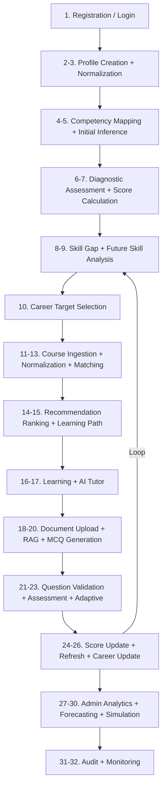
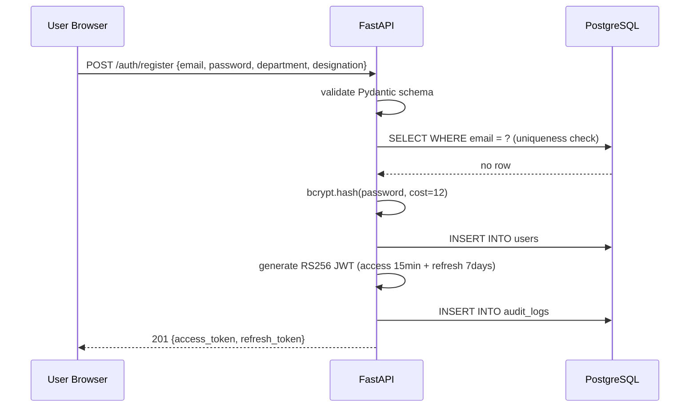
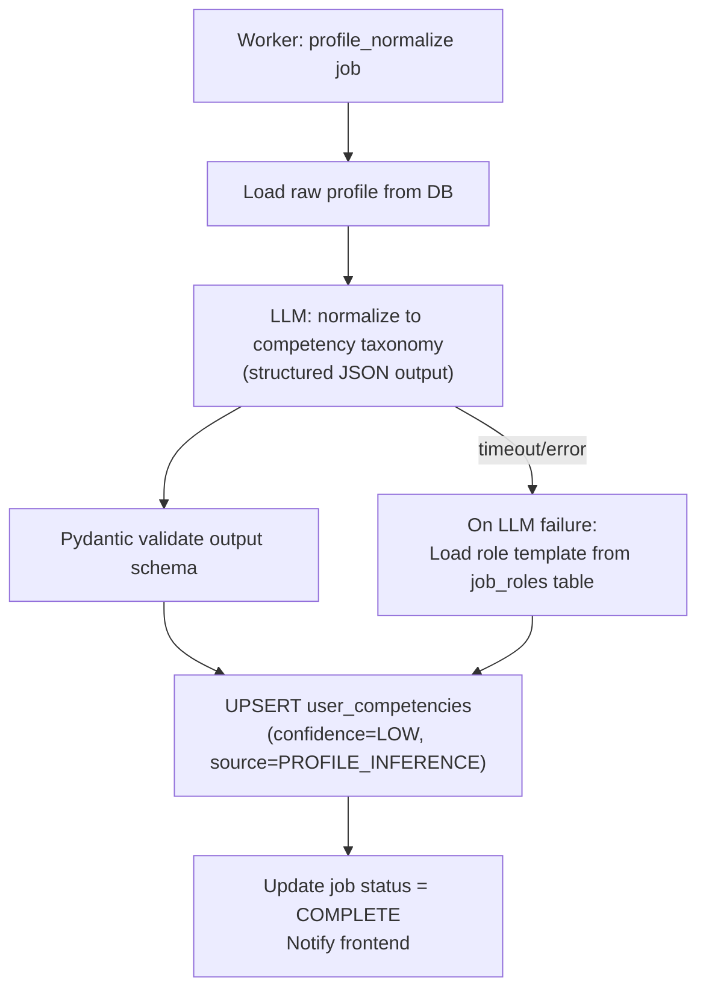
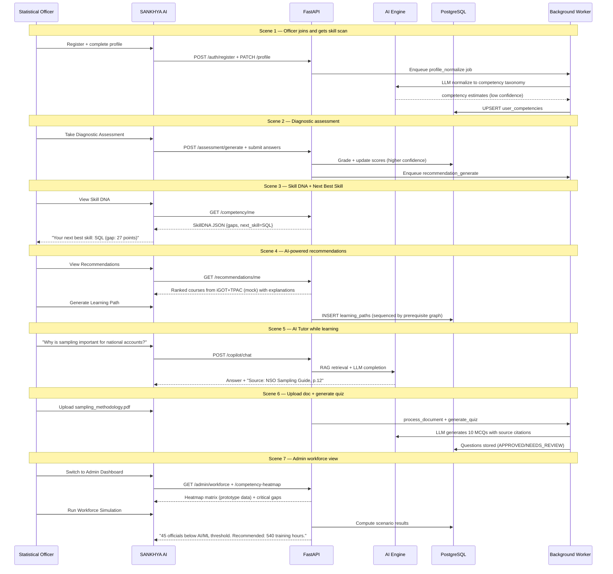

# SANKHYA AI — End-to-End System Workflow

> **Document status:** SIH 2026 | Problem Statement 26101
> This document describes the complete system as an implementation workflow — from the moment an official registers to workforce-level simulation. Every step includes actor, trigger, processing, AI logic, database operations, and error handling.

---

## Master Workflow Overview

---

## Step 1: Official Registration / Login

| Field | Detail |
|---|---|
| **Actor** | Government official (new user) |
| **Trigger** | User navigates to SANKHYA AI, clicks "Register" |
| **Input** | Email, password, employee ID (optional), department, designation |
| **Frontend action** | Registration form with Zod validation. Password strength meter. |
| **API call** | `POST /api/v1/auth/register` |
| **Backend processing** | Validate email uniqueness; hash password (bcrypt, cost 12); create user record; assign default role `EMPLOYEE`; generate JWT access + refresh tokens |
| **AI/ML processing** | None at this step |
| **DB operations** | `INSERT INTO users`; `INSERT INTO audit_logs (LOGIN_REGISTER)` |
| **Output** | JWT access token + refresh token; redirect to profile setup |
| **Next step** | Step 2 — Profile Creation |
| **Error cases** | Duplicate email → 409 Conflict; invalid password strength → 422 Validation error; DB write failure → 503 with retry message |
| **Security** | bcrypt hash stored, never plaintext; rate limit: 5 registration attempts / IP / hour; email verification hook (optional) |

---

## Step 2: Profile Creation

| Field | Detail |
|---|---|
| **Actor** | Official |
| **Trigger** | Post-registration redirect to `/profile/setup` |
| **Input** | Full name, designation (free text or dropdown), department, current role, years of experience, highest qualification, previous training courses (free text list), self-assessed skills (optional) |
| **Frontend action** | Multi-step wizard: Personal → Role → Experience → Skills. Progress bar. Skippable sections marked as reducing confidence. |
| **API call** | `PATCH /api/v1/profile` |
| **Backend processing** | Validate and store profile fields; enqueue `competency_analyze` job |
| **AI/ML processing** | None yet — queued for Step 3 |
| **DB operations** | `UPDATE users SET profile_data = ...`; `INSERT INTO training_history` (for each listed course) |
| **Output** | Profile saved; job_id returned for async analysis |
| **Next step** | Step 3 — Profile Normalization (background) |
| **Error cases** | Unsupported department value → validation error with suggestion; long free-text list → truncated with user warning |
| **Security** | Profile data access restricted to own user_id; audit log entry |

---

## Step 3: Profile Normalization

| Field | Detail |
|---|---|
| **Actor** | Background Worker (triggered by Step 2) |
| **Trigger** | `profile_normalize` job enqueued after profile save |
| **Input** | Raw profile: free-text designation, qualifications, training course names |
| **Frontend action** | Loading state on Skill DNA page: "Analyzing your profile..." |
| **API call** | Job status: `GET /api/v1/documents/{job_id}/job-status` (polling or WebSocket) |
| **Backend processing** | Worker picks up job; calls normalization service |
| **AI/ML processing** | LLM prompt: "Map this official's profile to the SANKHYA AI competency taxonomy. Return JSON {competency_id, initial_score_estimate, confidence, evidence_source}". Pydantic validates output. |
| **DB operations** | `UPSERT user_competencies` with `source='PROFILE_INFERENCE'`, `confidence=LOW (0.2-0.4)` |
| **Output** | Initial competency estimates stored; job status = COMPLETE |
| **Next step** | Step 4 — Competency Framework Mapping (immediate); Step 6 — Diagnostic assessment |
| **Error cases** | LLM returns unmappable role → fallback to role-based template from `job_roles` table; LLM timeout → retry 3x then mark job FAILED with partial results |
| **Security** | Profile data sent to LLM only via server-side API call; never from browser |

---

## Step 4: Competency Framework Mapping

| Field | Detail |
|---|---|
| **Actor** | System (automatic, triggered by profile normalization) |
| **Trigger** | Profile normalization complete |
| **Input** | User's department, designation, job_role_id |
| **Frontend action** | None — runs silently |
| **API call** | Internal service call within worker |
| **Backend processing** | Look up `job_role_competency_requirements` table; set `required_score` for each competency associated with the user's role |
| **AI/ML processing** | None — deterministic lookup |
| **DB operations** | `UPSERT user_competencies SET required_score = ?` for each competency in the role matrix |
| **Output** | Every user_competency row now has both `current_score` (from Step 3) and `required_score` (from role matrix) |
| **Next step** | Step 5 — Initial competency inference display |
| **Error cases** | Role has no competency requirements defined → warn admin; proceed with empty required_score |
| **Security** | Role-to-competency mapping is read from admin-configured seed data, not user-editable |

---

## Step 5: Initial Competency Inference

| Field | Detail |
|---|---|
| **Actor** | System + Learner (first view) |
| **Trigger** | Profile normalization complete; user opens Skill DNA page |
| **Input** | `user_competencies` rows from Steps 3 and 4 |
| **Frontend action** | Render Skill DNA radar chart; show confidence warning: "Initial estimate — complete a diagnostic assessment for accurate scores"; animate competency bars |
| **API call** | `GET /api/v1/competency/me` |
| **Backend processing** | Aggregate `user_competencies`; compute `overall_readiness`; identify `top_gap` and `next_best_skill` |
| **AI/ML processing** | None — all values from DB; `next_best_skill` derived from gap engine formula |
| **DB operations** | Read-only; result cached in Redis `competency:{user_id}` TTL 15 min |
| **Output** | Full Skill DNA JSON: per-competency scores, confidence, gaps, next best skill |
| **Next step** | Step 6 — Diagnostic Assessment |
| **Error cases** | No competencies mapped → show onboarding prompt; all scores at zero confidence → show verification needed banner |

---

## Step 6: Diagnostic Assessment

| Field | Detail |
|---|---|
| **Actor** | Learner |
| **Trigger** | User clicks "Take Diagnostic Assessment" on Skill DNA page |
| **Input** | Learner's current competency profile, selected competency domains to assess |
| **Frontend action** | Assessment UI: one question at a time, timer, competency label shown, progress bar, difficulty badge (Easy/Medium/Hard) |
| **API call** | `POST /api/v1/assessment/generate {type: "diagnostic", competency_ids: [...]}` |
| **Backend processing** | Fetch pre-generated questions from `questions` table filtered by competency + difficulty `easy/medium`; sequence them; create assessment session |
| **AI/ML processing** | Adaptive engine (Step 23) activates during the assessment. Initial questions set to MEDIUM difficulty. |
| **DB operations** | `INSERT INTO assessments`; `SELECT FROM questions WHERE competency_id IN (...) AND generation_status = 'APPROVED'` |
| **Output** | Assessment session ID; first question returned |
| **Next step** | Step 7 — Competency Score Calculation (after submission) |
| **Error cases** | Insufficient approved questions in bank → use AI-generated questions on-the-fly with source grounding; assessment session timeout → save partial progress |
| **Security** | Questions served by backend only; correct answers never sent to frontend |

---

## Step 7: Competency Score Calculation

| Field | Detail |
|---|---|
| **Actor** | System (triggered by assessment submission) |
| **Trigger** | Learner submits assessment: `POST /api/v1/assessment/{id}/submit` |
| **Input** | Question responses, user_id, competency_ids covered |
| **Frontend action** | Loading spinner: "Calculating your competency scores..." then results page |
| **API call** | `POST /api/v1/assessment/{id}/submit` + `GET /api/v1/assessment/{id}/results` |
| **Backend processing** | Grade responses; calculate per-competency assessment score; apply multi-signal formula to blend with existing signals |
| **AI/ML processing** | Formula: `NewScore = 0.7 * OldScore + 0.3 * AssessmentScore` (exponential moving average); confidence increases by 0.15 per assessment |
| **DB operations** | `INSERT INTO assessment_results`; `UPSERT user_competencies SET current_score, confidence, last_assessed_at`; `INSERT INTO audit_logs (ASSESSMENT_SUBMITTED)` |
| **Output** | Updated Skill DNA with higher-confidence scores; score change summary |
| **Next step** | Step 8 — Skill-Gap Detection |
| **Error cases** | Partial submission (browser closed) → save progress, allow resume; duplicate submission → idempotency check via assessment session state |
| **Security** | Assessment session validated server-side; cannot submit same session twice; time-bound session prevents async answer lookup |

---

## Step 8: Skill-Gap Detection

| Field | Detail |
|---|---|
| **Actor** | System (triggered by score update) |
| **Trigger** | Competency scores updated in Step 7 |
| **Input** | Updated `user_competencies` rows (current_score, required_score, future_score) |
| **Frontend action** | Gap analysis page shows updated gaps; priority badges update |
| **API call** | `GET /api/v1/competency/me/gaps` |
| **Backend processing** | For each competency: calculate `raw_gap`, `future_gap`, `priority_score`; sort by priority; identify top 3 critical gaps |
| **AI/ML processing** | Priority formula: `PriorityScore = RawGap * RoleImportanceWeight * FutureDemandWeight * CareerRelevanceWeight` |
| **DB operations** | Read-only on `user_competencies`; result cached in Redis |
| **Output** | Prioritized gap list with CRITICAL/HIGH/MEDIUM/LOW/OK labels; natural language explanation for top gaps |
| **Next step** | Step 9 — Future Skill Requirement Analysis; Step 10 — Career Target Selection; Step 14 — Recommendation |
| **Error cases** | All required_scores undefined → cannot calculate gaps → show "role requirements not configured" message to admin |

---

## Step 9: Future Skill Requirement Analysis

| Field | Detail |
|---|---|
| **Actor** | System (background, scheduled daily) |
| **Trigger** | Daily `forecast_skills` worker job; also triggered on-demand when user views "Future Skills" tab |
| **Input** | `skill_demand_rules` (configured weights + growth rates); user's current competencies |
| **Frontend action** | "Current vs Required vs Future" three-bar chart per competency; "Future critical" badges |
| **API call** | `GET /api/v1/admin/future-skills` (admin view) or embedded in `GET /api/v1/competency/me` (learner view) |
| **Backend processing** | Apply demand forecast formula to each competency; identify competencies where future_score >> current_score |
| **AI/ML processing** | `future_demand = base_demand * (1 + growth_rate) ^ years_ahead`; rule-based MVP |
| **DB operations** | `UPSERT skill_demand (competency_id, future_weight, projection_year)` |
| **Output** | Three-axis competency display: current, required, future for each skill |
| **Next step** | Feeds into gap priority calculation (Step 8) and recommendation ranking (Step 14) |
| **Error cases** | No demand rules configured → fall back to flat future_weight = required_weight |
| **Security** | Future demand data marked `is_prototype_data: true` in API response |

---

## Step 10: Career Target Selection

| Field | Detail |
|---|---|
| **Actor** | Learner |
| **Trigger** | User visits Career page; clicks "Set Career Target" |
| **Input** | Selected target job role from dropdown (populated from `job_roles` table) |
| **Frontend action** | Role browser with search, role description, required competency preview; "Set as Target" button |
| **API call** | `PATCH /api/v1/profile {target_role_id: "uuid"}` |
| **Backend processing** | Store target role; trigger career readiness calculation; update recommendation engine context |
| **AI/ML processing** | Career readiness formula applied immediately; gap analysis recalculated with career relevance weights |
| **DB operations** | `UPDATE users SET target_role_id = ?`; `INSERT INTO career_paths`; invalidate recommendation cache |
| **Output** | Career Readiness Score displayed; updated recommendations that factor in career path |
| **Next step** | Step 11 — Course Ingestion (recommendations now incorporate career path) |
| **Error cases** | Target role has no competency requirements → show "No requirements configured" with admin contact |

---

## Step 11: Course / Training Ingestion

| Field | Detail |
|---|---|
| **Actor** | Background Worker (scheduled daily + on-demand) |
| **Trigger** | Scheduled `sync_courses` job; also triggered by admin "Sync Now" action |
| **Input** | iGOT adapter + TPAC adapter course data |
| **Frontend action** | Admin: sync status indicator; learners: courses appear in recommendations |
| **API call** | Internal worker job (no direct user-facing endpoint for sync) |
| **Backend processing** | Call each adapter's `search_courses()` method; receive list of NormalizedCourse objects |
| **AI/ML processing** | None during ingestion; embedding happens separately (Step 13) |
| **DB operations** | `UPSERT courses`; `UPSERT course_competencies`; `UPDATE course_providers SET last_synced_at` |
| **Output** | Course catalogue updated in DB; worker logs sync count |
| **Next step** | Step 12 — iGOT/TPAC Normalization |
| **Error cases** | Adapter returns error → log, mark provider `sync_failed`, continue with cached data; empty response → no update, alert admin |
| **Security** | Adapter calls are server-side only; `is_mock: true` flag propagated to all mock-sourced courses |

---

## Step 12: iGOT / TPAC Normalization

| Field | Detail |
|---|---|
| **Actor** | Worker (continuation of Step 11) |
| **Trigger** | Immediately after raw course data received from adapters |
| **Input** | Raw adapter response (provider-specific format) |
| **Backend processing** | Map provider fields to `NormalizedCourse` schema: title, description, duration_hours, competency_ids, difficulty, enrollment_type |
| **AI/ML processing** | LLM used only if course description is missing competency mapping: "Which competencies from this taxonomy does this course description cover?" → returns `competency_ids` |
| **DB operations** | `UPSERT courses`; `UPSERT course_competencies` |
| **Output** | Unified course catalogue with consistent schema across all providers |
| **Next step** | Step 13 — Semantic Matching (embedding generation) |
| **Error cases** | LLM competency mapping returns unrecognized competency → log warning; map to closest match or skip |

---

## Step 13: Semantic Matching (Course Embedding)

| Field | Detail |
|---|---|
| **Actor** | Worker |
| **Trigger** | New/updated courses after normalization |
| **Input** | Course title + description text |
| **Backend processing** | Concatenate title + description; generate embedding vector |
| **AI/ML processing** | `embedding = embed_model.embed(course.title + " " + course.description)` |
| **DB operations** | `UPDATE courses SET embedding = ?` |
| **Output** | All courses have embedding vectors — enabling semantic search in recommendation step |
| **Next step** | Step 14 — Recommendation Ranking |
| **Error cases** | Embedding API failure → queue retry; course marked `embedding_pending`; excluded from semantic step until retry succeeds |

---

## Step 14: Recommendation Ranking

| Field | Detail |
|---|---|
| **Actor** | System (triggered on-demand) |
| **Trigger** | User visits Recommendations page; explicit `POST /api/v1/recommendations/generate`; score update invalidates cache |
| **Input** | User competency profile, gaps, target role, learning history |
| **Frontend action** | Recommendation cards with provider badge (iGOT/TPAC/Internal), gap coverage %, difficulty, duration, AI explanation |
| **API call** | `GET /api/v1/recommendations/me` (from cache) or `POST /api/v1/recommendations/generate` (fresh) |
| **Backend processing** | Step 1: Filter by role/level/prerequisites/language. Step 2: pgvector semantic search against user skill need embedding. Step 3: Apply ranking formula. |
| **AI/ML processing** | Ranking formula applied deterministically. LLM generates explanation string grounded in ranking features (does NOT determine ranking). |
| **DB operations** | `INSERT INTO recommendations (user_id, course_id, score, explanation, generated_at)`; cache in Redis |
| **Output** | Ranked list of courses with scores, explanations, provider badges, mock data flags |
| **Next step** | Step 15 — Learning Path Generation |
| **Error cases** | LLM explanation timeout → return recommendation with generic template explanation; no courses pass filter → relax prerequisites filter, warn user |

---

## Step 15: Personalized Learning Path Generation

| Field | Detail |
|---|---|
| **Actor** | System (triggered by user) |
| **Trigger** | User clicks "Generate Learning Path" on recommendations page |
| **Input** | Top-ranked recommendations, user's competency prerequisites, career target |
| **Frontend action** | Timeline-style learning path visualizer: sequenced steps with estimated completion dates, dependencies shown as arrows |
| **API call** | `POST /api/v1/learning-path/generate` |
| **Backend processing** | Topological sort of recommended courses using competency prerequisite graph; apply duration constraints (user's weekly hours); add calendar estimates |
| **AI/ML processing** | Graph traversal (topological sort) — deterministic, no LLM |
| **DB operations** | `INSERT INTO learning_paths`; `INSERT INTO learning_path_items` (one per course, with sequence_order) |
| **Output** | Ordered learning path with estimated hours, sequence rationale |
| **Next step** | Step 16 — Learning Activity Tracking |
| **Error cases** | Circular dependency in competency graph → break cycle at lowest-weight edge; no prerequisites → flat list sorted by priority score |

---

## Step 16: Learning Activity Tracking

| Field | Detail |
|---|---|
| **Actor** | Learner |
| **Trigger** | User marks course as "In Progress" or "Completed" |
| **Frontend action** | Learning path UI: progress checkboxes, completion button, progress percentage |
| **API call** | `PATCH /api/v1/learning-path/{id}/items/{item_id} {status: "completed"}` |
| **Backend processing** | Update item status; calculate overall path progress; if completed → trigger competency score update (enqueue re-analysis) |
| **AI/ML processing** | Completion triggers competency update (training_history signal updated) → recommendations refresh |
| **DB operations** | `UPDATE learning_path_items SET status, completed_at`; `UPDATE training_history`; invalidate recommendation cache |
| **Output** | Progress updated; if path complete → celebrate UI moment; re-analyze competencies |
| **Next step** | Step 24 (competency score update) if completed; Step 17 (AI Tutor) during learning |

---

## Step 17: AI Tutor Interaction

| Field | Detail |
|---|---|
| **Actor** | Learner |
| **Trigger** | User opens AI Copilot during learning activity |
| **Input** | User message (natural language question or doubt) |
| **Frontend action** | Chat interface with streaming responses; source citation bubbles below answer; "Related topic" suggestion chips |
| **API call** | `POST /api/v1/copilot/chat {message: "...", context: {current_course_id, current_competency}}` |
| **Backend processing** | Classify intent; load user learning context; retrieve relevant document chunks from pgvector; construct grounded prompt |
| **AI/ML processing** | 1) Intent classification (lightweight LLM call). 2) Chunk retrieval (pgvector cosine search). 3) LLM completion with RAG context. 4) Safety/source validation. |
| **DB operations** | `INSERT INTO copilot_messages (user_id, message, response, citations, intent)`; retrieve `document_chunks` |
| **Output** | Contextual answer with citations (document name + page); optional follow-up resource recommendation |
| **Next step** | Continues in chat; mistake explanation → Step 8 gap identification; resource recommendation → Step 14 |
| **Error cases** | No relevant chunks found → LLM returns "I don't have approved content on this topic yet. Suggested resource: [external link]"; LLM timeout → "Please try again. Retrieving your answer." |
| **Security** | User context loaded server-side; LLM calls server-side only; citations always from verified documents |

---

## Step 18: Document Upload

| Field | Detail |
|---|---|
| **Actor** | Trainer |
| **Trigger** | Trainer navigates to Document Studio; clicks "Upload Document" |
| **Input** | PDF / DOCX / PPTX file; metadata (title, competency tags, description) |
| **Frontend action** | Drag-and-drop upload zone; MIME type validation client-side; progress bar; metadata form |
| **API call** | `POST /api/v1/documents/upload` (multipart form) |
| **Backend processing** | Validate MIME type server-side; check file size (limit: 50MB); store to object storage; create `vault_documents` record; enqueue `process_document` job |
| **AI/ML processing** | None at upload — all processing is async |
| **DB operations** | `INSERT INTO vault_documents (title, file_path, status='PROCESSING', uploader_id)`; `INSERT INTO audit_logs (DOCUMENT_UPLOADED)` |
| **Output** | Document record created; `job_id` returned; upload confirmed |
| **Next step** | Step 19 — RAG Ingestion (background) |
| **Error cases** | Unsupported file type → 415 error with accepted types; file too large → 413 with size limit; virus scan failure → 422 with message |
| **Security** | Only TRAINER role can upload; file stored with random UUID filename (no path traversal); MIME validated server-side; trainer association stored |

---

## Step 19: RAG Ingestion

| Field | Detail |
|---|---|
| **Actor** | Background Worker |
| **Trigger** | `process_document` job enqueued after upload |
| **Input** | Document file from object storage; `document_id` |
| **Frontend action** | Document library shows "Processing" status with spinner |
| **API call** | Status check: `GET /api/v1/documents/{id}/job-status` |
| **Backend processing** | 1) Download from object storage. 2) Parse with appropriate parser (PyMuPDF/python-docx/python-pptx). 3) Extract text + metadata (page, section). 4) Clean text. 5) Chunk (512 tokens, 64 overlap). 6) For each chunk: generate embedding. 7) Store in `document_chunks`. |
| **AI/ML processing** | Embedding generation for each chunk via embedding model API |
| **DB operations** | `INSERT INTO document_chunks` (bulk insert); `UPDATE vault_documents SET status='READY', chunk_count`; update full-text search index |
| **Output** | Document fully ingested; available for RAG retrieval and quiz generation |
| **Next step** | Step 20 — MCQ/Quiz Generation |
| **Error cases** | Parse failure → `UPDATE vault_documents SET status='PARSE_FAILED'`; embedding failure → retry up to 3 times, then mark `EMBEDDING_FAILED`; both fail → notify trainer |

---

## Step 20: MCQ / Quiz Generation

| Field | Detail |
|---|---|
| **Actor** | Trainer |
| **Trigger** | Trainer clicks "Generate Quiz" on a processed document |
| **Input** | `document_id`, `competency_id`, `n_questions` (default: 10), `difficulty` |
| **Frontend action** | Generation dialog: select competency, count, difficulty level; "Generate" button; progress indicator |
| **API call** | `POST /api/v1/documents/{id}/generate-quiz {competency_id, n_questions, difficulty}` |
| **Backend processing** | Enqueue `generate_quiz` worker job; return `job_id` |
| **AI/ML processing** | Worker: 1) Retrieve top-K document chunks by competency. 2) Call LLM with structured prompt. 3) Receive JSON array of questions. 4) Run Assessment Quality Guard (Step 21). 5) Store approved questions to question bank. |
| **DB operations** | `INSERT INTO questions (generation_status='PENDING_REVIEW')` for all generated; update to `APPROVED` or `NEEDS_REVIEW` after quality guard |
| **Output** | Questions in question bank; trainer notified; count of approved vs review-needed |
| **Next step** | Step 21 — Question Validation |
| **Error cases** | LLM returns malformed JSON → Pydantic rejects → log + retry with clarified prompt; all questions fail quality guard → notify trainer, no questions published; document not yet processed → return 409 |
| **Security** | Only TRAINER role can trigger generation; audit log entry; generated questions not visible to learners until APPROVED |

---

## Step 21: Question Validation (Quality Guard)

| Field | Detail |
|---|---|
| **Actor** | System (automatic) + Trainer (human review) |
| **Trigger** | Automatic: immediately after LLM generation. Human: trainer opens "Pending Review" queue. |
| **Input** | Generated questions (JSON), source chunks (for grounding verification) |
| **Frontend action** | Trainer review queue: question text, options, correct answer, explanation, source page reference, quality score, approve/reject buttons |
| **API call** | `GET /api/v1/questions/pending-review`; `PATCH /api/v1/questions/{id}/approve` or `/reject` |
| **Backend processing** | Quality Guard pipeline: schema validation → source support check → ambiguity detection → duplicate detection → difficulty classification → competency mapping → compute quality score |
| **AI/ML processing** | Source support check uses embedding similarity (question vs source chunk). Ambiguity detection uses LLM (lightweight): "Is there exactly one correct answer to this question?" |
| **DB operations** | `UPDATE questions SET quality_score, generation_status` (APPROVED or NEEDS_REVIEW); `INSERT INTO audit_logs (QUESTION_APPROVED/REJECTED)` |
| **Output** | Questions with APPROVED status enter the live question bank; NEEDS_REVIEW questions wait for trainer |
| **Next step** | Step 22 — Learner Assessment |
| **Error cases** | Source chunk deleted before review → question marked NEEDS_REVIEW with "Source unavailable" flag; trainer rejects bulk → system logs rejection reason for model improvement |
| **Security** | Trainer can only review/approve questions they have access to; audit log tracks every review action |

---

## Step 22: Learner Assessment

| Field | Detail |
|---|---|
| **Actor** | Learner |
| **Trigger** | User clicks "Take Assessment" from learning path or recommendation page |
| **Input** | `assessment_id` or `competency_id` (system selects questions) |
| **Frontend action** | Full-screen assessment UI: question text, 4 options (A/B/C/D), current question number, time indicator, difficulty badge |
| **API call** | `GET /api/v1/assessment/{id}` (fetch questions) |
| **Backend processing** | Select approved questions for competency; shuffle options; create assessment session; record start time |
| **AI/ML processing** | Adaptive engine initializes (Step 23) |
| **DB operations** | `INSERT INTO assessment_sessions`; `SELECT FROM questions WHERE generation_status='APPROVED' AND competency_id=?` |
| **Output** | Assessment presented to learner question by question |
| **Next step** | Step 23 — Adaptive Difficulty Adjustment |

---

## Step 23: Adaptive Difficulty Adjustment

| Field | Detail |
|---|---|
| **Actor** | System (real-time, per question response) |
| **Trigger** | Learner answers each question |
| **Input** | `{question_id, selected_option, time_taken_seconds}` |
| **Frontend action** | Immediate transition to next question (no answer reveal during assessment); difficulty badge updates subtly |
| **API call** | `POST /api/v1/assessment/{id}/answer {question_id, option}` |
| **Backend processing** | Grade answer; update adaptive state (consecutive correct/wrong counters); select next question at adjusted difficulty level |
| **AI/ML processing** | Adaptive algorithm: correct × 2 → step up difficulty; wrong × 2 → step down; record `answered_questions [{question_id, correct, difficulty, time_taken}]` |
| **DB operations** | `INSERT INTO question_attempts`; update session state in Redis (fast read/write during assessment) |
| **Output** | Next question at adapted difficulty |
| **Next step** | After final question → Step 24 Score Update |
| **Error cases** | Question not in session → reject with 403; session expired → save partial, allow resume; browser disconnects → session resumable within 24 hours |

---

## Step 24: Competency Score Update

| Field | Detail |
|---|---|
| **Actor** | System |
| **Trigger** | Assessment submitted (`POST /api/v1/assessment/{id}/submit`) |
| **Input** | All `question_attempts` for the session; user_id; competency_ids covered |
| **Frontend action** | Results page: score per competency, correct/incorrect summary, explanation for wrong answers (source-cited), updated Skill DNA |
| **API call** | `GET /api/v1/assessment/{id}/results` |
| **Backend processing** | Calculate per-competency percentage from question attempts; apply exponential moving average to existing score; update confidence; store result |
| **AI/ML processing** | `NewScore = OldScore × 0.7 + AssessmentScore × 0.3`; `NewConfidence = min(1.0, OldConfidence + 0.15)` |
| **DB operations** | `INSERT INTO assessment_results`; `UPSERT user_competencies (current_score, confidence, last_assessed_at)`; `INSERT INTO audit_logs (ASSESSMENT_SUBMITTED)`; invalidate Redis cache |
| **Output** | Updated competency scores with increased confidence; results page shown |
| **Next step** | Step 25 — Recommendation Refresh; Step 26 — Career Readiness Update |
| **Error cases** | Duplicate submit → idempotency: return cached result; assessment session not found → 404 |
| **Security** | Session ownership validated; score calculation server-side only |

---

## Step 25: Recommendation Refresh

| Field | Detail |
|---|---|
| **Actor** | System (automatic, triggered by score update) |
| **Trigger** | Competency scores updated in Step 24 |
| **Input** | Updated competency profile |
| **Frontend action** | "Your recommendations have been updated" toast notification; recommendations page refreshes |
| **Backend processing** | Invalidate `recs:{user_id}` Redis cache; enqueue lightweight recommendation re-rank job |
| **AI/ML processing** | Full ranking formula re-applied with new scores and gaps |
| **DB operations** | `INSERT INTO recommendations` (new batch replaces old); cache updated |
| **Output** | Fresh recommendations reflecting post-assessment competency state |
| **Error cases** | Re-rank job fails → keep existing recommendations; user sees stale badge on recommendations page |

---

## Step 26: Career Readiness Update

| Field | Detail |
|---|---|
| **Actor** | System (triggered by score update) |
| **Trigger** | Competency scores updated and user has a target role set |
| **Input** | Updated competency profile; `target_role_id` |
| **Backend processing** | Recalculate career readiness score using formula; identify which gaps improved |
| **DB operations** | `UPSERT career_paths (readiness_score, updated_at)` |
| **Output** | Career readiness score updated; if major milestone (e.g., crosses 70%) → in-app celebration |
| **Next step** | Loop: return to Step 8 for next cycle of gap detection and recommendation |

---

## Step 27: Admin Workforce Analytics

| Field | Detail |
|---|---|
| **Actor** | Admin |
| **Trigger** | Admin opens Workforce Dashboard |
| **Input** | Department filter, date range |
| **Frontend action** | Heatmap of competency × department; critical gap table; training hours summary; trend charts |
| **API call** | `GET /api/v1/admin/workforce?department={id}&period={range}` |
| **Backend processing** | Serve from Redis cache if fresh; otherwise trigger background compute |
| **AI/ML processing** | None for display; worker job computes aggregates |
| **DB operations** | Complex aggregation: `SELECT competency_id, AVG(current_score), AVG(required_score) FROM user_competencies JOIN users ON ... GROUP BY competency_id, department_id` |
| **Output** | Dashboard data including heatmap matrix, critical gap list, avg readiness per department |
| **Error cases** | No officials in department → show empty state with onboarding guidance; cache miss + slow compute → show loading with progress indication |
| **Security** | Admin role required; data is department-level aggregates — no individual-level competency data exposed in default view |

---

## Step 28: Future Skill Forecasting

| Field | Detail |
|---|---|
| **Actor** | System (daily background job) + Admin (on-demand view) |
| **Trigger** | Scheduled daily; admin clicks "Refresh Forecast" |
| **Input** | `skill_demand_rules` configuration; current workforce competency distribution |
| **Frontend action** | "Future Skills" tab in admin: ranked list of emerging competencies with demand trajectory chart; prototype data badge |
| **API call** | `GET /api/v1/admin/future-skills` |
| **Backend processing** | Apply demand forecast formula per competency; rank by future demand weight; identify largest future-vs-current gaps organizationally |
| **AI/ML processing** | Rule-based MVP: `future_demand = base * (1 + growth)^years`. Advanced: ML model trained on workforce data (roadmap). |
| **DB operations** | `UPSERT skill_demand (competency_id, future_weight, forecast_year, is_prototype)` |
| **Output** | Ranked future skills list; "AI/ML will be critical for 87% of roles in 3 years" style insight — always marked **Prototype Data** |
| **Error cases** | No demand rules configured → show setup guidance to admin; computation error → serve last successful forecast with staleness timestamp |
| **Security** | Admin role required; `is_prototype_data: true` always included in response metadata |

---

## Step 29: Workforce Simulation

| Field | Detail |
|---|---|
| **Actor** | Admin |
| **Trigger** | Admin opens Workforce Simulator; defines a scenario |
| **Input** | Scenario name; new capability requirements (competency → target_score pairs) |
| **Frontend action** | Scenario builder: add competency requirements with sliders; "Run Simulation" button; results show current vs projected readiness bars |
| **API call** | `POST /api/v1/admin/workforce/simulate {scenario_name, requirements: [{competency_id, target_score}]}` |
| **Backend processing** | For each official: check current score vs scenario requirements; aggregate below-threshold counts; estimate training hours |
| **AI/ML processing** | None — deterministic aggregation + training hour estimation (average hours per competency-point from historical data) |
| **DB operations** | `INSERT INTO workforce_scenarios`; `INSERT INTO scenario_results`; mark all with `is_prototype_data: true` |
| **Output** | Simulation report: officials below threshold per skill; total training hours; recommended training plan; projected readiness after plan |
| **Error cases** | No officials in DB → return empty simulation with setup guidance; computation timeout (>10 sec) → async job, poll for result |
| **Security** | Admin only; simulation runs on aggregated data; no individual-level details in results |

---

## Step 30: Training Plan Generation

| Field | Detail |
|---|---|
| **Actor** | System (generated from simulation result) |
| **Trigger** | Workforce simulation completes |
| **Input** | Simulation result: competencies with gaps, official counts, available courses |
| **Backend processing** | Match gap competencies to available courses; group officials by gap severity; estimate timeline |
| **AI/ML processing** | LLM generates executive summary of the training plan in natural language (grounded in simulation data, not invented) |
| **DB operations** | `UPDATE scenario_results SET training_plan_json, executive_summary` |
| **Output** | Actionable training plan: "Run SQL for Data Analysis for 45 officials in Labour Statistics department. Estimated: 12 hours per official. Provider: iGOT [mock]. Timeline: 6 weeks." |

---

## Step 31: Audit / Security Flow

| Field | Detail |
|---|---|
| **Actor** | System (automatic) |
| **Trigger** | Every security-relevant action |
| **Processing** | Every API handler that modifies state calls `audit_service.log(actor_id, action, resource_type, resource_id, result)` |
| **DB operations** | `INSERT INTO audit_logs` — insert-only, no UPDATE/DELETE |
| **Retention** | Audit logs retained for minimum 1 year; archived to cold storage after 90 days |
| **Security controls** | Log table: no application-level DELETE permission; INSERT only via service account; IP address and user agent captured |
| **Error cases** | Audit log INSERT failure does NOT block the primary operation — logged to system logger as critical alert |

---

## Step 32: Monitoring and Failure Recovery

| Field | Detail |
|---|---|
| **Actor** | System (continuous) |
| **Metrics collected** | API latency, error rates, queue depth, worker success/failure, DB connection pool, LLM API latency, quality guard rejection rate |
| **Alerting triggers** | Error rate > 5%, queue depth > 100 jobs, LLM failure rate > 20%, DB connection pool > 80% |
| **Recovery procedures** | LLM failures: exponential backoff + fallback provider. Worker failures: retry queue + dead letter. DB failures: circuit breaker + 503 to client. Redis failure: graceful degradation (bypass cache). |
| **Demo resilience** | Seed data deterministic — same demo produces same result. All AI outputs cached. Fallback to cached recommendations if LLM unavailable. Offline mode: Ollama local LLM as fallback. |

---

## Complete System Sequence: Demo Story

---

*See also: [01-TECHNICAL-DETAILS.md](./01-TECHNICAL-DETAILS.md) · [02-TECH-STACK-AND-WHY.md](./02-TECH-STACK-AND-WHY.md) · [03-RESOURCES.md](./03-RESOURCES.md)*
