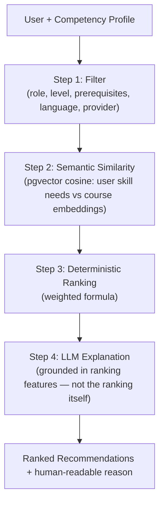
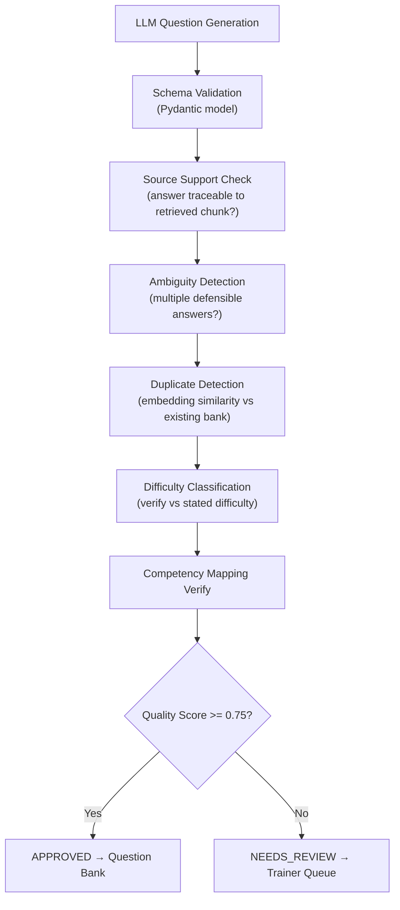

# SANKHYA AI — Complete AI/NLP Architecture & Implementation Guide

> **Document status:** SIH 2026 | Problem Statement 26101
> **Purpose:** End-to-end AI/NLP technical architecture, implementation plan, and SIH presentation strategy

---

## Table of Contents

1. [Project Status Analysis](#1-project-status-analysis)
2. [SIH Presentation Architecture](#2-sih-presentation-architecture)
3. [AI Component Inventory](#3-ai-component-inventory)
4. [What We Train vs What We Don't](#4-what-we-train-vs-what-we-dont)
5. [RAG Pipeline (Core AI Component)](#5-rag-pipeline-core-ai-component)
6. [Embedding Model Selection](#6-embedding-model-selection)
7. [Document Processing Pipeline](#7-document-processing-pipeline)
8. [Competency Scoring Formula](#8-competency-scoring-formula)
9. [Gap Priority Engine](#9-gap-priority-engine)
10. [Recommendation Engine](#10-recommendation-engine)
11. [MCQ Generation & Quality Guard](#11-mcq-generation--quality-guard)
12. [Data Sources & Classification](#12-data-sources--classification)
13. [Hardware Requirements](#13-hardware-requirements)
14. [Project Folder Structure](#14-project-folder-structure)
15. [Implementation Timeline (10 Days)](#15-implementation-timeline-10-days)
16. [Demo Script (5 Minutes)](#16-demo-script-5-minutes)
17. [Key Risks & Mitigations](#17-key-risks--mitigations)
18. [SIH Judge Questions (40+)](#18-sih-judge-questions-40)

---

## 1. Project Status Analysis

### Current State

| Aspect | Status |
|--------|--------|
| Documentation | ✅ Excellent — 5 comprehensive docs |
| Architecture Design | ✅ Complete — all formulas, schemas, flows defined |
| Tech Stack Decisions | ✅ Fully justified with alternatives |
| Resources & References | ✅ Verified government + research sources |
| End-to-End Workflow | ✅ 32-step implementation workflow |
| Implementation Code | ❌ Zero — no code written yet |
| Database Schema | ❌ No migrations or models |
| Frontend Components | ❌ No React/Next.js code |
| Backend Services | ❌ No FastAPI code |
| AI Pipeline | ❌ No embedding/RAG/LLM code |
| Seed Data | ❌ No competency framework seeded |

### Quality Assessment

The documentation is exceptional and covers:
- Complete system architecture with Mermaid diagrams
- 34-section engineering reference
- Technology decisions with alternatives considered
- 32-step workflow with actor, trigger, API, AI logic, DB ops, errors per step
- Demo strategy with timing
- Risk mitigation strategies
- Terminology consistency checklist

**Gap:** All work remains to be implemented.

---

## 2. SIH Presentation Architecture

### One-Liner for Judges

> "SANKHYA AI is a competency intelligence platform that uses semantic embeddings, RAG-grounded AI, and deterministic scoring to close skill gaps in India's Official Statistical System."

### The Honest Technical Story

```
YOUR AI PLATFORM
       │
   ┌───┼────────────────┐
   │   │                │
EMBEDDINGS    RAG         TRADITIONAL ML
   │   │                │
Semantic    AI Tutor      Skill Scoring
Search     MCQ Generation  Gap Analysis
Course     Q&A Grounding   Prediction
Matching   Source Citation  Analytics
   │   │                │
   └───┼────────────────┘
       │
RECOMMENDATION
ENGINE
       │
PERSONALIZED
LEARNING PATH
```

### What You Can Honestly Say at SIH

> "We use **pretrained AI models** with **domain-specific data** — not a foundation model trained from scratch. Our intelligence layer combines:
> - **Semantic embeddings** (text-embedding-004) for course matching and document retrieval
> - **RAG pipeline** for grounded AI tutoring and MCQ generation
> - **Deterministic scoring** for competency assessment (6-signal weighted formula)
> - **Hybrid recommendations** (filter → semantic search → ranking formula → LLM explanation)"

### What You Do NOT Claim

- "We trained our own LLM"
- "We built a transformer from scratch"
- "We fine-tuned GPT-4 on government data"

### Key Differentiator for Judges

> "Our system is **explainable**. Every competency score has a formula. Every recommendation has a deterministic ranking. Every AI answer cites its source. This is not a black box — it's an auditable intelligence system suitable for government deployment."

---

## 3. AI Component Inventory

| Component | Technology | What It Does | What Trains It |
|-----------|-----------|--------------|----------------|
| **Embeddings** | text-embedding-004 (Google) | Text → vectors for semantic search | **NOT trained by you** (pretrained) |
| **RAG Engine** | Custom Python + pgvector | Retrieve relevant docs before LLM generates | **NOT trained** (indexing only) |
| **LLM** | Gemini Flash/Pro (API) | Generate answers, MCQs, explanations | **NOT trained** (prompt engineering only) |
| **Competency Scoring** | Python weighted formula | 6-signal score calculation | **Deterministic formula** (no training) |
| **Gap Engine** | Python priority formula | Rank skill gaps by importance | **Deterministic formula** (no training) |
| **Recommendation** | Hybrid (pgvector + formula + LLM explanation) | Rank courses for learners | **NOT trained** (filtering + ranking) |
| **Adaptive Assessment** | Python state machine | Adjust difficulty based on performance | **NOT trained** (rule-based) |
| **Quality Guard** | LLM + embedding similarity | Validate generated MCQs | **NOT trained** (validation pipeline) |
| **Skill Forecasting** | Rule-based (MVP) | Predict future skill demand | **Configurable rules** (no training) |

---

## 4. What We Train vs What We Don't

### For the Hackathon: Nothing Trained

Everything uses:
1. **Pretrained models** (embeddings, LLM via API)
2. **Deterministic formulas** (scoring, ranking, gaps)
3. **Rule-based logic** (adaptive difficulty, forecasting)
4. **RAG indexing** (embedding + storing documents)

### Optional Post-Hackathon

- Fine-tune a small classifier for competency mapping (if labeled data available)
- Train forecasting model on actual workforce data (if MoSPI data sharing agreement)

### Why This Approach

| Factor | Training from Scratch | Pretrained + Formulas |
|--------|----------------------|----------------------|
| Time | Months | Days |
| GPU | Required | Not needed |
| Data | Millions of examples | Dozens of seed records |
| Quality | Unknown until trained | Immediately usable |
| Cost | High compute | Low API cost |
| SIH Demo | Risky | Reliable |

---

## 5. RAG Pipeline (Core AI Component)

### Complete Flow

```
DOCUMENT UPLOAD
       │
       ▼
TEXT EXTRACTION (PyMuPDF / python-docx / python-pptx)
       │
       ▼
CLEANING (remove headers, normalize whitespace)
       │
       ▼
CHUNKING (512 tokens, 64 token overlap)
       │
       ▼
EMBEDDING (text-embedding-004 → 768 dimensions)
       │
       ▼
STORE IN PGVECTOR (document_chunks table)
       │
       ▼
USER QUERY EMBEDDING → COSINE SIMILARITY SEARCH → TOP-K CHUNKS
       │
       ▼
LLM PROMPT: "Based on these chunks: {chunks}. Answer: {query}"
       │
       ▼
GROUNDED ANSWER + SOURCE CITATION
```

### Why RAG Over Pure LLM

| Problem | Pure LLM | RAG |
|---------|----------|-----|
| Hallucination | High risk | Low risk (grounded) |
| Domain knowledge | Generic | Specific to your documents |
| Source attribution | None | Yes (which chunk, which page) |
| Up-to-date | No (knowledge cutoff) | Yes (re-index documents) |
| Government suitability | Unreliable | Auditable |

### Chunk Schema

```sql
CREATE TABLE document_chunks (
    id UUID PRIMARY KEY,
    document_id UUID REFERENCES vault_documents(id),
    chunk_index INT NOT NULL,
    content TEXT NOT NULL,
    page_number INT,
    section TEXT,
    source_type TEXT,        -- 'pdf', 'docx', 'pptx', 'transcript'
    competency_ids UUID[],   -- mapped competencies
    embedding vector(1536),  -- dimension matches embedding model
    created_at TIMESTAMPTZ DEFAULT now()
);
CREATE INDEX ON document_chunks USING ivfflat (embedding vector_cosine_ops);
```

### Semantic Retrieval (Pseudocode)

```python
async def retrieve_relevant_chunks(query, top_k=5, competency_filter=None):
    query_embedding = await embed(query)
    results = await db.execute("""
        SELECT *, 1 - (embedding <=> $1) AS similarity
        FROM document_chunks
        WHERE ($2::uuid[] IS NULL OR competency_ids && $2)
        ORDER BY embedding <=> $1
        LIMIT $3
    """, query_embedding, competency_filter, top_k)
    return results
```

### Example: User Query

**User asks:** "What training should I take to improve my sampling skills?"

**RAG Process:**
1. Query → embedding vector
2. Cosine similarity search against document_chunks
3. Top results:
   - "Stratified sampling divides the population into subgroups..." (0.97)
   - "Sampling is the process of selecting a subset..." (0.82)
   - "Cluster sampling is used when population is spread..." (0.78)
4. Send chunks + question to LLM
5. LLM generates grounded answer
6. System appends: "Source: Sampling Methods Manual, p.18"

---

## 6. Embedding Model Selection

### Options Evaluated

| Model | Dimensions | Cost | Quality | Recommendation |
|-------|-----------|------|---------|----------------|
| text-embedding-004 (Google) | 768 | Low | High multilingual | **Primary** |
| text-embedding-3-small (OpenAI) | 1536 | Very low | High English | Fallback |
| all-MiniLM-L6-v2 (local HuggingFace) | 384 | Free | Good English | Offline fallback |
| multilingual-e5-large (HuggingFace) | 1024 | Free | Good multilingual | Future Hindi support |

### Why text-embedding-004

| Factor | Benefit |
|--------|---------|
| Multilingual | Future Hindi/Bengali support without model change |
| Low cost | Google free tier covers hackathon |
| 768 dimensions | Good balance of quality and storage |
| API-based | No GPU needed on student laptop |
| Indian language support | Relevant for government statistical content |

### How Embeddings Work

```
"Python for statistical analysis"  →  [0.23, -0.45, 0.67, ...]
"Programming using Python for data processing"  →  [0.21, -0.42, 0.65, ...]

Cosine similarity between them: 0.95 (very close → semantically similar)
```

### Cosine Similarity Scale

| Score | Meaning |
|-------|---------|
| 1.0 | Identical meaning |
| 0.9+ | Very similar |
| 0.7-0.9 | Related |
| 0.5-0.7 | Somewhat related |
| < 0.5 | Unrelated |

---

## 7. Document Processing Pipeline

### Format Support

| Format | Library | What It Extracts | Notes |
|--------|---------|------------------|-------|
| PDF | PyMuPDF (fitz) | Text per page, tables, metadata | Best Python PDF parser |
| DOCX | python-docx | Paragraphs, headings, tables | Standard for Word docs |
| PPTX | python-pptx | Slide text, notes, titles | For presentation decks |
| TXT | Built-in | Raw text | Plain text files |
| CSV | pandas | Row data as text | Tabular data |
| HTML | BeautifulSoup | Clean text extraction | Web content |

### Chunking Strategy

| Parameter | Value | Rationale |
|-----------|-------|-----------|
| Chunk size | 512 tokens | Standard for official document RAG |
| Overlap | 64 tokens | Prevents context loss at boundaries |
| Strategy | Sentence-aware | Don't split mid-sentence |
| Metadata | page, section, document_id, competency_ids | Enables filtered retrieval |

### Why Bad Chunking Causes Bad RAG

- **Too small (128 tokens):** Loses context, retrieval misses connections
- **Too large (2048 tokens):** Imprecise retrieval, wastes LLM context window
- **No overlap:** Information at chunk boundaries is lost
- **Split mid-sentence:** Creates incomplete thoughts, confuses LLM

### Complete Document Pipeline

```python
async def process_document(document_id: str):
    # 1. Download from object storage
    file_path = await download_document(document_id)

    # 2. Parse based on format
    if file_path.endswith('.pdf'):
        text_blocks = extract_pdf(file_path)  # PyMuPDF
    elif file_path.endswith('.docx'):
        text_blocks = extract_docx(file_path)  # python-docx
    elif file_path.endswith('.pptx'):
        text_blocks = extract_pptx(file_path)  # python-pptx

    # 3. Clean text
    cleaned_blocks = [clean_text(block) for block in text_blocks]

    # 4. Chunk
    chunks = chunk_text(cleaned_blocks, size=512, overlap=64)

    # 5. Embed each chunk
    embeddings = await embed_chunks(chunks)

    # 6. Store in pgvector
    await store_chunks(document_id, chunks, embeddings)

    # 7. Update document status
    await update_document_status(document_id, 'READY')
```

---

## 8. Competency Scoring Formula

### Multi-Signal Scoring

```
CompetencyScore(c, u) =
    0.30 × DiagnosticAssessment(c, u)
  + 0.20 × PracticalEvidence(c, u)
  + 0.15 × WorkExperience(c, u)
  + 0.15 × TrainingHistory(c, u)
  + 0.10 × ProfileEvidence(c, u)
  + 0.10 × RecentLearningPerformance(c, u)
```

### Signal Details

| Signal | Weight | What It Measures | Data Source |
|--------|--------|------------------|-------------|
| Diagnostic Assessment | 0.30 | Direct skill measurement | Assessment results |
| Practical Evidence | 0.20 | Task performance, submitted work | Course exercises |
| Work Experience | 0.15 | Role tenure × relevance coefficient | User profile |
| Training History | 0.15 | Completed courses, certifications | Learning records |
| Profile Evidence | 0.10 | Self-declared + LLM-normalized | Profile page |
| Recent Learning Performance | 0.10 | Quiz scores in last 90 days | Recent assessments |

### Confidence Score

```
Confidence(c, u) = (signals_available / total_signals) × signal_quality_factor
Range: 0.0 to 1.0
Threshold for "Needs Verification" flag: < 0.4
```

### Score Update After Assessment

```
NewScore(c, u) = OldScore(c, u) × (1 - 0.3) + AssessmentScore(c, u) × 0.3
NewConfidence  = min(1.0, OldConfidence + 0.15)
```

### Implementation

```python
def calculate_competency_score(user_id: str, skill_id: str) -> CompetencyScore:
    signals = {
        'diagnostic': get_diagnostic_score(user_id, skill_id),      # 0-100
        'practical': get_practical_score(user_id, skill_id),        # 0-100
        'experience': get_experience_score(user_id, skill_id),      # 0-100
        'training': get_training_score(user_id, skill_id),          # 0-100
        'profile': get_profile_score(user_id, skill_id),            # 0-100
        'recent': get_recent_performance(user_id, skill_id),        # 0-100
    }

    weights = {
        'diagnostic': 0.30,
        'practical': 0.20,
        'experience': 0.15,
        'training': 0.15,
        'profile': 0.10,
        'recent': 0.10,
    }

    final_score = sum(signals[k] * weights[k] for k in signals)
    confidence = sum(1 for v in signals.values() if v is not None) / len(signals)

    return CompetencyScore(
        current_score=min(final_score, 100),
        confidence=min(confidence, 1.0),
        evidence_sources=[k for k, v in signals.items() if v is not None]
    )
```

---

## 9. Gap Priority Engine

### Gap Calculation

```
RawGap(c, u)      = RequiredScore(c, role) - CurrentScore(c, u)
FutureGap(c, u)   = FutureScore(c) - CurrentScore(c, u)

PriorityScore(c, u) =
    RawGap(c, u)
    × RoleImportanceWeight(c, role)
    × FutureDemandWeight(c)
    × CareerRelevanceWeight(c, u.target_role)
```

### Priority Classification

| Priority | Condition |
|----------|-----------|
| **CRITICAL** | RawGap >= 30 AND FutureDemandWeight > 0.7 |
| **HIGH** | RawGap >= 20 OR FutureDemandWeight > 0.5 |
| **MEDIUM** | RawGap >= 10 |
| **LOW** | RawGap > 0 |
| **OK** | RawGap <= 0 |

### Example Output

```
Competency: AI / ML
Current:        24    Required:  60    Future:  82
Raw Gap:        36    Future Gap: 58
Priority:       CRITICAL
Reason: Gap of 36 points + very high future demand (weight: 0.83)
        + prerequisite for 4 other required competencies
```

### Implementation

```python
def calculate_gap_priority(user_id: str, role_id: str) -> list[GapResult]:
    competencies = get_role_competencies(role_id)
    gaps = []

    for comp in competencies:
        current = get_user_score(user_id, comp.id)
        required = get_role_requirement(role_id, comp.id)
        future = get_future_demand(comp.id)

        raw_gap = required - current
        future_gap = future - current

        priority_score = (
            raw_gap
            * get_role_importance(comp.id, role_id)
            * get_future_demand_weight(comp.id)
            * get_career_relevance(comp.id, user_id)
        )

        priority = classify_priority(raw_gap, get_future_demand_weight(comp.id))

        gaps.append(GapResult(
            competency_id=comp.id,
            current=current,
            required=required,
            future=future,
            raw_gap=raw_gap,
            future_gap=future_gap,
            priority_score=priority_score,
            priority=priority
        ))

    return sorted(gaps, key=lambda g: g.priority_score, reverse=True)
```

---

## 10. Recommendation Engine

### Hybrid Algorithm



### Ranking Formula

```
RecommendationScore(course, user) =
    0.30 × NormalizedGapCoverage(course, user)
  + 0.20 × RoleRelevance(course, role)
  + 0.15 × FutureDemandWeight(course.competencies)
  + 0.15 × CareerPathRelevance(course, user.target_role)
  + 0.10 × PrerequisiteMatch(course, user.competencies)
  + 0.10 × LearningHistoryDiversity(course, user)
```

### Key Principle

> The LLM receives ranking features as structured context. It phrases the explanation — it does **not** decide the ranking.

### Learning Path Generation

After ranking, courses are sequenced using:
1. Topological sort on competency prerequisite graph
2. Duration constraints (user-specified weekly hours)
3. Provider diversity (mix iGOT, TPAC, internal)

---

## 11. MCQ Generation & Quality Guard

### Generation Pipeline

```
DOCUMENT CHUNKS
       │
       ▼
RAG RETRIEVAL (top-K chunks by competency)
       │
       ▼
LLM PROMPT (structured JSON output)
       │
       ▼
GENERATED MCQs (question, options, answer, explanation)
       │
       ▼
QUALITY GUARD (7-stage pipeline)
       │
       ▼
APPROVED / NEEDS_REVIEW
```

### Quality Guard Pipeline



### Quality Score Formula

```
QualityScore =
    source_support_score   × 0.40
  + answer_unambiguity     × 0.30
  + difficulty_match       × 0.20
  + competency_match       × 0.10

Auto-approval threshold: 0.75
Below threshold: Status = NEEDS_REVIEW
```

### Sample MCQ Generation Prompt

```python
PROMPT = f"""
Based on the following content, generate 5 MCQ questions.

Content:
{relevant_chunks}

Requirements:
1. Questions should test understanding, not just memorization
2. 4 options each (A, B, C, D)
3. One correct answer
4. Include explanation for correct answer
5. Difficulty level: {difficulty}
6. Map each question to a competency area

Return as JSON:
{{
    "questions": [
        {{
            "question": "...",
            "options": {{
                "A": "...",
                "B": "...",
                "C": "...",
                "D": "..."
            }},
            "correct_answer": "B",
            "explanation": "...",
            "competency": "Survey Design",
            "difficulty": "medium"
        }}
    ]
}}
"""
```

### Sample Generated MCQ

```json
{
    "question": "What is the primary advantage of stratified sampling over simple random sampling?",
    "options": {
        "A": "It is faster to implement",
        "B": "It ensures representation from all subgroups",
        "C": "It requires less data",
        "D": "It is cheaper"
    },
    "correct_answer": "B",
    "explanation": "Stratified sampling divides the population into subgroups (strata) and samples from each, ensuring all groups are represented. Simple random sampling might miss smaller subgroups.",
    "competency": "Survey Design",
    "difficulty": "medium"
}
```

---

## 12. Data Sources & Classification

### Source Categories

| Source | Type | How Used | Legal Status | Training Suitability |
|--------|------|----------|--------------|---------------------|
| iGOT Karmayogi courses | Mock/seeded | Recommendation engine | ⚠️ Prototype only | Not for training |
| NSSTA/TPAC programmes | Mock/seeded | Recommendation engine | ⚠️ Prototype only | Not for training |
| MoSPI documents | RAG ingestion | AI Tutor, MCQ generation | ✅ Public government docs | Not for training |
| data.gov.in datasets | RAG ingestion | Domain context | ✅ Open government data | Not for training |
| User assessments | Direct input | Competency scoring | ✅ User-provided | Not for training |
| Competency frameworks | Seeded | Skill requirements | ✅ Manually curated | Not for training |
| User learning history | Tracked | Recommendation context | ✅ System-generated | Not for training |
| Synthetic demo data | Generated | Hackathon demo | ✅ No real PII | Not for training |

### Data Classification

```
TRAINING DATA          → None for hackathon (all pretrained)
KNOWLEDGE BASE DATA    → MoSPI docs, course descriptions, competency frameworks
USER DATA              → Profiles, assessments, learning history
TEST DATA              → Seeded demo data (clearly flagged is_prototype_data)
```

---

## 13. Hardware Requirements

### Component Requirements

| Component | Student Laptop | Cloud Deployment |
|-----------|---------------|------------------|
| Embedding generation | CPU sufficient (API call) | Cloud Run |
| RAG queries | CPU sufficient (pgvector) | Cloud SQL |
| LLM inference | API calls (Gemini) | Cloud Run |
| Local LLM fallback | Ollama + 8GB RAM | Not needed |
| Fine-tuning | GPU required (post-hackathon only) | Vertex AI |
| PostgreSQL + pgvector | 4GB RAM sufficient | Cloud SQL |
| Redis | 1GB RAM sufficient | Memorystore |

### Student Laptop is Sufficient

The hackathon prototype requires:
- Docker Desktop installed
- 8GB RAM minimum (16GB recommended)
- 10GB free disk space
- Internet connection (for Gemini API calls)
- No GPU required

### Post-Hackathon Production Requirements

| Component | Specification |
|-----------|--------------|
| API servers | 2 vCPU, 4GB RAM each |
| Database | 4 vCPU, 16GB RAM, 100GB SSD |
| Redis | 2 vCPU, 4GB RAM |
| Workers | 2 vCPU, 4GB RAM each |

---

## 14. Project Folder Structure

```
sankhya-ai/
├── docker-compose.yml              # All services
├── .env.example                    # Environment template
├── README.md                       # Quick start guide
│
├── apps/
│   └── web/                        # Next.js Frontend
│       ├── app/
│       │   ├── (auth)/
│       │   │   ├── login/page.tsx
│       │   │   └── register/page.tsx
│       │   ├── (learner)/
│       │   │   ├── dashboard/page.tsx
│       │   │   ├── skill-dna/page.tsx
│       │   │   ├── learning-path/page.tsx
│       │   │   ├── recommendations/page.tsx
│       │   │   ├── assessment/[id]/page.tsx
│       │   │   ├── copilot/page.tsx
│       │   │   └── career/page.tsx
│       │   ├── (trainer)/
│       │   │   ├── documents/page.tsx
│       │   │   ├── quiz-studio/page.tsx
│       │   │   └── question-bank/page.tsx
│       │   ├── (admin)/
│       │   │   ├── workforce/page.tsx
│       │   │   ├── heatmap/page.tsx
│       │   │   ├── forecast/page.tsx
│       │   │   └── simulator/page.tsx
│       │   ├── layout.tsx
│       │   └── page.tsx
│       ├── components/
│       │   ├── ui/                  # shadcn/ui primitives
│       │   ├── competency/          # Skill DNA, radar charts
│       │   ├── learning/            # Path visualizer, course cards
│       │   ├── assessment/          # Question renderer
│       │   ├── copilot/             # Chat interface
│       │   └── admin/               # Heatmaps, workforce charts
│       ├── lib/
│       │   ├── api.ts               # Typed API client
│       │   ├── auth.ts              # Auth helpers
│       │   └── hooks/               # React Query hooks
│       ├── types/                   # Shared TypeScript types
│       ├── tailwind.config.ts
│       ├── package.json
│       └── next.config.ts
│
├── services/
│   └── api/                         # FastAPI Backend
│       ├── main.py                  # App entry point
│       ├── config.py                # pydantic-settings
│       ├── database.py              # SQLAlchemy async engine
│       ├── deps.py                  # Dependency injection
│       ├── routers/
│       │   ├── auth.py
│       │   ├── users.py
│       │   ├── competencies.py
│       │   ├── assessments.py
│       │   ├── recommendations.py
│       │   ├── courses.py
│       │   ├── learning.py
│       │   ├── analytics.py
│       │   ├── ai.py
│       │   └── integrations.py
│       ├── models/
│       │   ├── user.py
│       │   ├── competency.py
│       │   ├── assessment.py
│       │   ├── course.py
│       │   └── document.py
│       ├── schemas/
│       │   ├── user.py
│       │   ├── competency.py
│       │   ├── assessment.py
│       │   └── course.py
│       ├── services/
│       │   ├── user_service.py
│       │   ├── competency_service.py
│       │   ├── assessment_service.py
│       │   ├── recommendation_service.py
│       │   └── ai_service.py
│       ├── ai/
│       │   ├── orchestrator.py
│       │   ├── competency_engine.py
│       │   ├── gap_engine.py
│       │   ├── recommendation_engine.py
│       │   ├── rag_engine.py
│       │   ├── assessment_engine.py
│       │   ├── quality_guard.py
│       │   └── forecasting_engine.py
│       ├── integrations/
│       │   ├── igot_adapter.py
│       │   └── tpac_adapter.py
│       ├── workers/
│       │   ├── document_processing.py
│       │   ├── embedding_generation.py
│       │   ├── quiz_generation.py
│       │   └── settings.py
│       ├── alembic/                 # DB migrations
│       ├── tests/
│       ├── Dockerfile
│       └── requirements.txt
│
├── ai/
│   ├── embeddings/
│   │   ├── provider.py              # LLMProvider protocol
│   │   ├── google_provider.py       # text-embedding-004
│   │   └── local_provider.py        # sentence-transformers fallback
│   ├── rag/
│   │   ├── chunker.py               # 512-token chunks, 64 overlap
│   │   ├── ingest.py                # Document → chunks → embeddings → pgvector
│   │   └── retriever.py             # Cosine similarity search
│   ├── assessment/
│   │   ├── mcq_generator.py         # LLM prompt → MCQ JSON
│   │   └── quality_guard.py         # 7-stage validation
│   ├── competency/
│   │   ├── scoring.py               # 6-signal weighted formula
│   │   └── gap_engine.py            # Priority scoring
│   ├── recommendation/
│   │   ├── hybrid_recommender.py    # Filter + semantic + ranking
│   │   └── learning_path.py         # Topological sort
│   ├── prompts/
│   │   ├── mcq_generation.txt
│   │   ├── profile_normalization.txt
│   │   ├── explanation_generation.txt
│   │   └── tutor_response.txt
│   ├── evaluation/
│   │   ├── rag_eval.py              # Faithfulness, relevance
│   │   └── mcq_eval.py              # Correctness, quality
│   └── pipelines/
│       ├── document_pipeline.py     # Upload → parse → chunk → embed → store
│       └── assessment_pipeline.py   # Generate → validate → approve
│
├── data/
│   ├── seed/
│   │   ├── competencies.json        # 30-50 competencies
│   │   ├── job_roles.json           # Statistical Officer, etc.
│   │   ├── courses.json             # Mock iGOT/TPAC courses
│   │   └── departments.json         # MoSPI departments
│   └── sample_documents/            # Demo PDFs for RAG
│
└── docs/                            # Existing documentation
    ├── 00-INDEX.md
    ├── 01-TECHNICAL-DETAILS.md
    ├── 02-TECH-STACK-AND-WHY.md
    ├── 03-RESOURCES.md
    ├── 04-END-TO-END-WORKFLOW.md
    ├── 05-AI-NLP-ARCHITECTURE-GUIDE.md  ← THIS FILE
    └── ARCHITECTURE.md
```

---

## 15. Implementation Timeline (10 Days)

### Phase 1 — Foundation (Days 1-2)

| Task | Description | Deliverable |
|------|-------------|-------------|
| Docker Compose | postgres + pgvector + redis services | `docker-compose.yml` |
| FastAPI skeleton | App entry point, config, DB engine | `services/api/main.py` |
| Auth endpoints | Register, login, JWT, RBAC | `routers/auth.py` |
| DB schema | Users, departments, roles, competencies | `models/*.py` + Alembic migrations |
| Seed competency framework | 30-50 competencies, 4 domains | `data/seed/competencies.json` |
| Next.js skeleton | Auth pages, role-based routing | `apps/web/app/` |

### Phase 2 — Competency Core (Days 3-4)

| Task | Description | Deliverable |
|------|-------------|-------------|
| Multi-signal scoring | 6-signal weighted formula | `ai/competency/scoring.py` |
| Competency analyze endpoint | `POST /api/v1/competency/analyze` | `routers/competencies.py` |
| user_competencies upsert | Score calculation + DB write | `services/competency_service.py` |
| Gap engine | Priority scoring + classification | `ai/competency/gap_engine.py` |
| Skill DNA endpoint | `GET /api/v1/competency/me` | API endpoint |
| Skill DNA UI | Radar chart + bar charts | React components |

### Phase 3 — Recommendations (Day 5)

| Task | Description | Deliverable |
|------|-------------|-------------|
| Course model | DB schema for courses | `models/course.py` |
| Mock iGOT/TPAC data | Seeded course catalogue | `data/seed/courses.json` |
| Recommendation ranking | Weighted formula | `ai/recommendation/hybrid_recommender.py` |
| Course embeddings | Worker job for embedding generation | `workers/embedding_generation.py` |
| Recommendations API + UI | End-to-end recommendation flow | Full stack |
| Learning path generator | Topological sort | `ai/recommendation/learning_path.py` |

### Phase 4 — Assessment AI (Days 6-7)

| Task | Description | Deliverable |
|------|-------------|-------------|
| Document upload | Endpoint + object storage | `routers/ai.py` |
| Document processing worker | PyMuPDF + chunking + embedding | `ai/pipelines/document_pipeline.py` |
| MCQ generation worker | LLM + quality guard | `ai/pipelines/assessment_pipeline.py` |
| Question bank | Trainer review UI | `routers/assessments.py` |
| Adaptive assessment | Step-up/down difficulty engine | `ai/assessment_engine.py` |
| Assessment learner UI | Take quiz, see results | React components |

### Phase 5 — AI Tutor + Career (Day 8)

| Task | Description | Deliverable |
|------|-------------|-------------|
| RAG retrieval service | Cosine similarity search | `ai/rag/retriever.py` |
| Copilot chat endpoint | Intent classification + RAG + LLM | `routers/ai.py` |
| Chat UI | Streaming + citations | React copilot component |
| Career readiness score | Formula + gap analysis | `services/competency_service.py` |
| Career path UI | Target role selection | React career component |

### Phase 6 — Admin + Workforce (Day 9)

| Task | Description | Deliverable |
|------|-------------|-------------|
| Workforce dashboard | Aggregated competency data | `routers/analytics.py` |
| Heatmap visualization | Competency × department matrix | React admin components |
| Future skill forecasting | Rule-based demand prediction | `ai/forecasting_engine.py` |
| Workforce simulator | What-if scenario runner | API + UI |
| Audit logging | Insert-only audit trail | Throughout all endpoints |

### Phase 7 — Demo Hardening (Day 10)

| Task | Description | Deliverable |
|------|-------------|-------------|
| Full seed data | Officials, courses, documents, assessments | `data/seed/` |
| Pre-generated question banks | Approved MCQs for demo documents | Pre-run pipeline |
| Loading/error/empty states | All pages handle edge cases | UI polish |
| End-to-end demo run | Full 5-minute demo flow | Verified |
| Docker Compose final test | `docker compose up` → full demo | Working prototype |

---

## 16. Demo Script (5 Minutes)

### Scene 1: The Problem (30 seconds)

> "An official in India's Labour Statistics department has access to hundreds of iGOT courses — but no way to know which matter, which are missing, or what skills their organization needs in the next 3 years. SANKHYA AI solves this."

### Scene 2: Skill DNA (45 seconds)

- Show a pre-onboarded Statistical Officer profile
- Click "AI Skill Scan" → radar chart animates
- Point out: current (blue) vs required (orange) vs future (red) on each axis
- Highlight: "AI/ML — Critical Gap. 24% current, 60% required, 82% future demand"

### Scene 3: Next Best Skill (30 seconds)

- Show Next Best Skill card: "SQL — 27 point gap"
- Click "Why" → explanation: role requirement + prerequisite for 3 other competencies + high future demand
- Click "Generate Learning Path" → sequenced 6-course path appears

### Scene 4: iGOT + TPAC Recommendations (30 seconds)

- Show unified recommendation list with provider badges (iGOT / TPAC / Internal)
- ⚠️ Point out prototype badge — "Our adapter is live-ready; awaiting official API access"
- Show one recommendation explanation: "Recommended because your SQL score is below role requirement..."

### Scene 5: AI Assessment Studio (60 seconds)

- Switch to Trainer view
- Upload `sampling_methodology.pdf`
- Click "Generate Quiz" → 10 questions appear with source page citations
- Click Approve on 2-3 questions
- Show a question: text, 4 options, correct answer, "Source: Sampling Methods Manual, p.18"

### Scene 6: AI Tutor (30 seconds)

- Learner view: open Copilot
- Ask: "Why did I get the sampling frame question wrong?"
- Show answer with citation: "Source: Sampling Guide, p.23"

### Scene 7: Workforce Simulator (45 seconds)

- Switch to Admin view
- Show heatmap: Labour (AI/ML: 39%), Agriculture (AI/ML: 31%)
- Open Workforce Simulator
- Set "AI/ML: 75% required for all roles"
- Click Run → "67 officials below threshold. Estimated: 804 training hours. Projected readiness: 71% → 85%"

### Scene 8: Close the Loop (20 seconds)

> "SANKHYA AI is not a course catalogue. It is a continuous competency-to-workforce intelligence loop — from individual skill scan to national workforce readiness."

---

## 17. Key Risks & Mitigations

| Risk | Severity | Mitigation |
|------|----------|------------|
| iGOT/TPAC API unavailable | Critical | Mock adapters with honest `is_mock: true` labels |
| LLM provider downtime during demo | Critical | Ollama local fallback + cached outputs |
| RAG pipeline latency | High | Pre-process demo documents before demo |
| Quality guard rejects all questions | High | Pre-generate and approve demo question bank |
| pgvector performance at scale | Medium | Acceptable at hackathon scale |
| Multilingual support missing | Medium | Mark as Phase 2 roadmap |
| Network failure during demo | Medium | All AI outputs cached; offline mode available |
| Competency formula produces unexpected scores | Medium | Unit tests with deterministic seed data |
| Circular dependency in competency graph | Low | Detect and break cycles during seed data creation |
| Frontend rendering performance | Low | Next.js SSR + React Query caching |

---

## 18. SIH Judge Questions (40+)

### Architecture & Design

| # | Question | Short Answer | Deep Technical Answer | Follow-up |
|---|----------|--------------|----------------------|-----------|
| 1 | Why RAG instead of just using an LLM? | Prevents hallucination; grounds answers in approved source documents | RAG retrieves relevant document chunks before LLM generates. Every answer cites its source. LLM only sees verified content, not open-ended generation. | How do you ensure the retrieved chunks are actually relevant? |
| 2 | Why embeddings? | Semantic search — find related content by meaning, not just keywords | Text is converted to 768-dimensional vectors. Cosine similarity finds vectors with small angle (similar meaning). "Python data analysis" matches "statistical programming using Python" even though keywords differ. | What happens when two concepts have similar embeddings but different meanings? |
| 3 | Why pgvector over Pinecone/Weaviate? | Same database for relational + vector work | Eliminates a separate service. Enables JOIN between vector search results and user/competency data in one query. Sufficient performance for hackathon scale. | What are the scale limits of pgvector? |
| 4 | Why not fine-tune a model? | No labeled data, no GPU, no time | Fine-tuning requires domain-specific labeled datasets, GPU compute, and iterative evaluation. For hackathon, pretrained models + RAG + prompt engineering deliver comparable quality immediately. | When would you recommend fine-tuning? |
| 5 | Where does training data come from? | No training data needed for hackathon | Competency frameworks are manually curated. Course data is seeded from mock iGOT/TPAC. Document content comes from public government publications. All AI uses pretrained models. | What about production deployment with real government data? |
| 6 | Did you train your own model? | No — we use pretrained AI models with domain-specific data | Our approach is honest and practical. Foundation model training requires massive compute and data. We combine pretrained embeddings, RAG, and deterministic formulas for a defensible, explainable system. | What is your actual contribution vs just calling APIs? |
| 7 | How do you prevent hallucination? | RAG + source restrictions + structured output + validation + human review | 7-layer approach: (1) RAG grounding, (2) structured output schemas, (3) Pydantic validation, (4) source support check, (5) confidence thresholds, (6) human-in-the-loop, (7) citation display. | What if the source document itself contains errors? |
| 8 | How do you evaluate MCQs? | 7-stage quality guard pipeline | Schema validation → source support check → ambiguity detection → duplicate detection → difficulty classification → competency mapping → quality score ≥ 0.75 for approval. | What's your false positive rate? |
| 9 | How do you calculate competency? | 6-signal weighted formula | Diagnostic assessment (0.30) + practical evidence (0.20) + work experience (0.15) + training history (0.15) + profile evidence (0.10) + recent learning (0.10). All weights configurable. | How do you handle conflicting signals? |
| 10 | How does recommendation work? | Hybrid: filter → semantic search → ranking formula → LLM explanation | Filter by role/level/prerequisites. Semantic similarity via pgvector. Deterministic ranking formula. LLM explains the ranking — it does NOT decide the ranking. | How do you handle the cold-start problem? |

### Technical Implementation

| # | Question | Short Answer | Deep Technical Answer | Follow-up |
|---|----------|--------------|----------------------|-----------|
| 11 | How does cold-start work for new users? | Profile-based initial inference + diagnostic assessment | LLM normalizes free-text profile to competency taxonomy. Initial scores have LOW confidence (0.2-0.4). System recommends diagnostic assessment first. As more signals accumulate, confidence increases. | What if the user skips the diagnostic? |
| 12 | How does multilingual support work? | text-embedding-004 supports multilingual natively | The embedding model handles Hindi, Bengali, etc. without separate models. LLM (Gemini) also supports Indian languages. Translation models available for Phase 2. | What about code-switching (Hindi-English mix)? |
| 13 | How does the system scale? | Horizontal scaling + caching + background workers | FastAPI instances scale horizontally. Redis caches competency profiles (15 min TTL). ARQ workers handle heavy jobs. pgvector IVFFlat index for vector search. | What's the bottleneck at 10,000 users? |
| 14 | What happens if the LLM is unavailable? | Fallback to cached recommendations + Ollama local LLM | All AI outputs cached in Redis. Local Ollama provides offline fallback. Deterministic formulas continue working. Only generative features (MCQ, tutor) are affected. | How often does the LLM actually fail? |
| 15 | What happens if iGOT APIs are unavailable? | Mock adapter with seeded data + honest labeling | Adapter pattern with `is_mock: true` flag. Architecture is live-ready — only adapter implementation changes when API credentials are available. | When will you have real API access? |
| 16 | How does adaptive assessment work? | Simplified step-up/step-down algorithm | Correct × 2 → difficulty increases. Wrong × 2 → difficulty decreases. MVP uses this simplified approach. Advanced: Item Response Theory (IRT) in roadmap. | How does IRT improve over simple step-up/down? |
| 17 | How does the quality guard work? | 7-stage validation pipeline | Schema validation → source support → ambiguity detection → duplicate detection → difficulty classification → competency mapping → quality score. Auto-approve ≥ 0.75. | What if quality guard is too strict? |
| 18 | How does career readiness work? | Weighted sum of competency coverage | For each competency: min(current, required) / required. Average across all required competencies. Shows gap to target role. | How does it handle roles with different competency sets? |
| 19 | How does the workforce simulator work? | Deterministic aggregation of competency data | For each scenario: check all officials against new requirements. Count below threshold. Estimate training hours. Project readiness after completion. | What if you have 100,000 officials? |
| 20 | How does future skill forecasting work? | Rule-based MVP with configurable demand weights | Each competency has base demand weight + annual growth rate. Future demand = base × (1 + growth)^years. Advanced: ML model on workforce data (roadmap). | How accurate are the rule-based forecasts? |

### Data & Privacy

| # | Question | Short Answer | Deep Technical Answer | Follow-up |
|---|----------|--------------|----------------------|-----------|
| 21 | Where does training data come from? | No training data for hackathon | Competency frameworks manually curated. Mock course data from iGOT/TPAC pattern. Documents from public MoSPI publications. User data is self-provided + system-generated. | How do you handle real government data in production? |
| 22 | How do you ensure data privacy? | JWT + RBAC + audit logging + data minimization | RS256 JWT tokens. Role-based access control. Insert-only audit logs. No PII in logs. DPDP Act 2023 compliance considered. | What about government data classification? |
| 23 | How do you handle government data classification? | Public documents for RAG; user data stays in system | MoSPI public publications are publicly available. User assessment data stays within the platform. No data sent to external services without explicit consent. | What about NIC Cloud deployment? |
| 24 | Is this compliant with DPDP Act 2023? | Yes — data minimization, purpose limitation, consent | Personal data collected only for competency assessment. Purpose clearly communicated. User can request deletion. Audit trail maintained. | How do you handle data retention? |
| 25 | What about government SSO integration? | Architecture-ready; swap auth router for OIDC | `users.external_id` field stores SSO identity. Auth router is the only component that changes. Business logic unchanged. | When will NIC SSO be available? |

### Evaluation & Metrics

| # | Question | Short Answer | Deep Technical Answer | Follow-up |
|---|----------|--------------|----------------------|-----------|
| 26 | How do you evaluate RAG quality? | Faithfulness + context relevance + answer relevance | Faithfulness: answer grounded in retrieved chunks? Context relevance: chunks relevant to query? Answer relevance: answer addresses query? Manual evaluation on sample set. | What's your RAG accuracy? |
| 27 | How do you evaluate competency scoring? | Unit tests with deterministic seed data | Test cases where expected scores are known. Formula correctness verified. Edge cases: zero signals, all signals, conflicting signals. | How do you validate with real users? |
| 28 | How do you evaluate recommendation quality? | Precision@K, completion rate, skill improvement | Top-K recommendations that users actually enroll in. Course completion rates. Post-course competency score improvement. | What's your recommendation accuracy? |
| 29 | How do you evaluate MCQ quality? | Correctness, relevance, difficulty, grounding, duplicate rate | Manual review of sample questions. Correctness verified against source. Difficulty matches Bloom's taxonomy. No duplicates in bank. | What's your auto-approval rate? |
| 30 | How do you measure skill improvement? | Pre/post assessment score delta | Diagnostic assessment before learning path. Assessment after completion. Delta calculated. Tracked over time. | How do you control for other factors? |

### Deployment & Operations

| # | Question | Short Answer | Deep Technical Answer | Follow-up |
|---|----------|--------------|----------------------|-----------|
| 31 | How do you deploy this? | Docker Compose for hackathon; Cloud Run for production | 5 services: frontend, api, worker, postgres, redis. `docker compose up` starts everything. Production: Cloud Run + Cloud SQL + Memorystore. | What about NIC Cloud? |
| 32 | How do you monitor AI operations? | Structured logging + metrics | Every LLM call logs model, tokens, latency, success. Redis queue depth tracked. Worker success/failure rates. Quality guard rejection rates. | What alerts do you have? |
| 33 | How do you handle LLM cost? | Caching + fallback + token optimization | Competency scores cached 15 min. Recommendations cached 30 min. Only generative features hit LLM. Prompt engineering minimizes tokens. | What's the monthly LLM cost? |
| 34 | How do you ensure reproducibility? | Docker Compose + seed data + deterministic formulas | Same seed data produces same demo. Deterministic formulas are reproducible. LLM outputs cached after first generation. | What about non-deterministic LLM outputs? |
| 35 | How do you handle failures? | Retry + fallback + circuit breaker + graceful degradation | LLM: retry 3x with backoff; fallback to cached. Redis: bypass cache. PostgreSQL: circuit breaker + 503. Workers: retry queue + dead letter. | What's your SLA target? |

### Business & Impact

| # | Question | Short Answer | Deep Technical Answer | Follow-up |
|---|----------|--------------|----------------------|-----------|
| 36 | What problem does this solve? | Skill gaps in India's Official Statistical System | Officials don't know their skill gaps. Training is generic. No connection between job requirements and learning. No competency tracking. SANKHYA AI solves all four. | How many officials would benefit? |
| 37 | How is this different from iGOT? | iGOT is a course catalogue; SANKHYA AI is intelligence | iGOT provides courses. SANKHYA AI tells you which courses you need, when you need them, and why. It's a recommendation engine on top of iGOT. | Would iGOT adopt this? |
| 38 | What's the impact? | Measurable skill improvement across government | Personalized learning paths. Competency tracking. Workforce analytics. Training budget optimization. Policy evidence. | How do you measure impact? |
| 39 | Is this scalable nationally? | Yes — cloud-native, API-first, modular | Docker containers scale horizontally. API-first design enables mobile apps. Modular architecture allows incremental feature addition. | What's the deployment timeline? |
| 40 | What's the roadmap? | Hackathon → Pilot → National rollout | Phase 1: Hackathon prototype. Phase 2: Pilot with MoSPI. Phase 3: Multi-ministry rollout. Phase 4: International adaptation. | What's the budget? |

---

## Final Summary

### What We Build

| Component | Technology | Training Required |
|-----------|-----------|-------------------|
| Embeddings | text-embedding-004 (pretrained) | None |
| RAG | Custom Python + pgvector | None (indexing only) |
| LLM | Gemini Flash/Pro (API) | None (prompt engineering) |
| Competency Scoring | Python weighted formula | None (deterministic) |
| Gap Engine | Python priority formula | None (deterministic) |
| Recommendations | Hybrid (pgvector + formula) | None |
| Adaptive Assessment | Python state machine | None (rule-based) |
| Quality Guard | LLM + embedding similarity | None (validation pipeline) |
| Skill Forecasting | Rule-based (MVP) | None (configurable rules) |

### What We Do NOT Build

| Component | Why Not |
|-----------|---------|
| Train LLM from scratch | No data, no GPU, no time, not needed |
| Fine-tune models | No labeled dataset, not needed for hackathon |
| Separate vector database | pgvector sufficient, reduces complexity |
| Live iGOT/TPAC integration | API access not available; mock adapters |
| Multilingual translation | Mark as Phase 2 |
| Video transcription | Mark as Phase 2 |
| IRT-based adaptive testing | Mark as roadmap |

### The Honest Technical Story

> "We use **pretrained AI models** with **domain-specific data** rather than training a foundation model from scratch. Our intelligence layer combines semantic embeddings, RAG-grounded generation, deterministic competency scoring, and hybrid recommendations — all designed for explainability, auditability, and government deployment readiness."

---

*Document created: 2026-09-10 | SANKHYA AI Team | SIH 2026*
